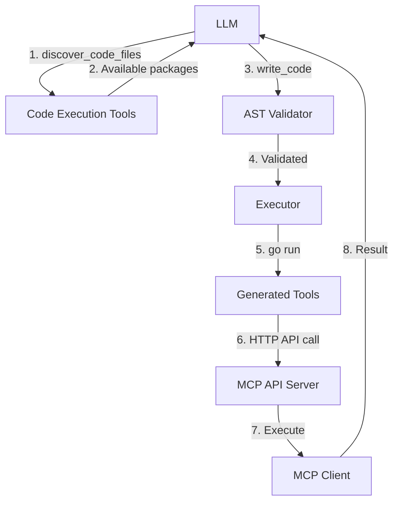

# Code Execution Agent Architecture

## 📋 Overview

The **Code Execution Agent** allows LLMs to write and execute Go code instead of making JSON-based tool calls. The LLM generates Go programs that import and utilize MCP tools as native functions.

**Key Benefits:**
- **Type Safety**: Go compiler enforces correct types
- **Complex Logic**: Native loops, conditionals, data transformations
- **Tool Chaining**: Multiple tool calls in single execution
- **Error Handling**: Functions return strings with error indicators (no error return value)

---

## 📁 Key Files & Locations

| Component | File Path | Key Functions |
|-----------|-----------|---------------|
| **Agent Core** | [`mcpagent/agent/agent.go`](../agent/agent.go) | `NewAgent()`, `WithCodeExecutionMode()`, `SetFolderGuardPaths()` |
| **Code Execution Tools** | [`mcpagent/agent/code_execution_tools.go`](../agent/code_execution_tools.go) | `handleDiscoverCodeFiles()`, `handleWriteCode()`, `validateCodeForForbiddenFileIO()` |
| **Code Validation** | [`mcpagent/agent/code_execution_tools.go`](../agent/code_execution_tools.go) | `validateCodeForForbiddenFileIO()`, `validateWorkspaceToolPaths()` |
| **Code Generator** | [`mcpagent/mcpcache/codegen/generator.go`](../mcpcache/codegen/generator.go) | `GenerateServerToolsCode()`, `GenerateFunctionWithParams()` |
| **Code Templates** | [`mcpagent/mcpcache/codegen/templates.go`](../mcpcache/codegen/templates.go) | `GenerateStruct()`, `GenerateAPIClient()`, `GeneratePackageHeader()` |
| **Prompt Builder** | [`mcpagent/agent/prompt/builder.go`](../agent/prompt/builder.go) | `GetCodeExecutionInstructions()`, `BuildSystemPromptWithoutTools()` |

**Generated Code Locations:**
- `generated/<server>_tools/` - Auto-generated Go packages for each MCP server
- `generated/agents/<agent-id>/workspace_tools/` - Agent-specific workspace tools with folder guards

---

## 🔄 System Lifecycle

### 1. Initialization
```go
agent := mcpagent.NewAgent(llmClient, mcpagent.WithCodeExecutionMode(true))
agent.SetFolderGuardPaths([]string{"/app/workspace"}, []string{"/app/workspace"})
```
- Standard tool registration is **disabled**
- Only code execution tools (`discover_code_files`, `write_code`) are registered

### 2. MCP Server Connection → Code Generation
When an MCP server connects, wrapper code is auto-generated:

```
generated/google_sheets_tools/
├── create_spreadsheet.go
├── read_spreadsheet.go
└── api_client.go          # Shared HTTP client with callAPI()
```

### 3. LLM Discovery
LLM calls `discover_code_files` → receives JSON with available packages/functions:
```json
{
  "servers": [{
    "name": "google-sheets",
    "package": "google_sheets_tools",
    "tools": ["CreateSpreadsheet", "ReadSpreadsheet"]
  }],
  "workspace_tools": {
    "package": "workspace_tools",
    "tools": ["ReadWorkspaceFile", "UpdateWorkspaceFile"]
  }
}
```

### 4. Code Execution Flow
1. LLM calls `write_code(go_source, args?)` (args is optional)
2. Code validated via AST analysis
3. Temporary workspace created: `workspace/code_<timestamp>/`
4. Code + `go.work` written
5. Executed: `go run main.go [args...]` (with timeout)
6. Output captured, workspace cleaned up
7. Result returned to LLM

---

## 🏗️ Architecture Diagram



---

## 🧩 Generated Code Example

**Input:** Google Sheets tool `create_spreadsheet`

**Output:** `generated/google_sheets_tools/create_spreadsheet.go`

```go
package google_sheets_tools

type CreateSpreadsheetParams struct {
	Title  string   `json:"title"`
	Sheets []string `json:"sheets,omitempty"`
}

func CreateSpreadsheet(params CreateSpreadsheetParams) string {
	payload := map[string]interface{}{
		"server": "google-sheets",
		"tool":   "create_spreadsheet",
		"args":   paramsToMap(params),
	}
	return callAPI("/api/mcp/execute", payload)
}
```

**LLM Usage:**
```go
package main

import (
	"fmt"
	"strings"
	"google_sheets_tools"
)

func main() {
	// Call tool function
	output := google_sheets_tools.CreateSpreadsheet(
		google_sheets_tools.CreateSpreadsheetParams{
			Title: "My Spreadsheet",
		},
	)
	
	// Print output to see results
	fmt.Printf("Tool output: %s\n", output)
	
	// Check output for errors - examine the output string to detect error indicators
	if strings.HasPrefix(output, "Error:") {
		fmt.Printf("❌ Error detected: %s\n", output)
		return
	}
	
	fmt.Printf("✅ Success! Result: %s\n", output)
}
```

---

## 🔒 Security & Validation

### AST-Based Validation

**File:** [`mcpagent/agent/code_execution_tools.go`](../agent/code_execution_tools.go)

| Check | Forbidden | Allowed |
|-------|-----------|---------|
| **Imports** | `io/ioutil`, `os/exec` | `fmt`, `strings`, `encoding/json`, generated packages |
| **OS Functions** | `os.ReadFile`, `os.WriteFile`, `os.Create` | None - use `workspace_tools` |
| **Paths** | Absolute paths, `..` traversal | Relative paths within workspace |

**Example:**
```go
// ❌ BLOCKED
file, _ := os.Open("/etc/passwd")

// ✅ ALLOWED
output := workspace_tools.ReadWorkspaceFile(
	workspace_tools.ReadWorkspaceFileParams{Filepath: "config.json"},
)
// Check output for errors
if strings.HasPrefix(output, "Error:") {
	// Handle error
}
```

### Error Handling Pattern

**Functions return only `string` (no error):**
- **API Errors** (network, HTTP): Functions **panic** - exceptional cases
- **Tool Execution Errors**: Returned in result string with "Error:" prefix
- **Always print output first**, then examine it to detect errors

### Folder Guard
```go
agent.SetFolderGuardPaths(
	[]string{"/app/workspace"},  // Read paths
	[]string{"/app/workspace"},  // Write paths
)
```

### Execution Isolation
- Fresh temporary directory per execution
- 30-second timeout (configurable)
- Process isolation via `go run`
- Automatic cleanup

---

## ⚙️ Configuration

### Environment Variables

| Variable | Default | Purpose |
|----------|---------|---------|
| `MCP_API_URL` | `http://localhost:8000` | API endpoint for generated code |
| `WORKSPACE_DIR` | `./workspace` | Workspace root directory |
| `CODE_EXECUTION_TIMEOUT` | `30s` | Max execution time |
| `GENERATED_CODE_DIR` | `./generated` | Generated packages location |

### Agent Options

```go
agent := mcpagent.NewAgent(
	llmClient,
	mcpagent.WithCodeExecutionMode(true),
	mcpagent.WithTimeout(60 * time.Second),
	mcpagent.WithLogger(logger),
)
```

---

## 🛠️ Common Issues & Solutions

| Issue | Cause | Solution |
|-------|-------|----------|
| `package not found` | Generated code missing | Check `generated/` exists, restart agent |
| `forbidden import` | Used `io/ioutil` or `os` | Use `workspace_tools` package instead |
| `path outside boundary` | Absolute path or `..` | Use relative paths within workspace |
| `validation failed` | Blocked OS function | Error message shows correct alternative |
| `not enough return values` | Old generated code | Clear `generated/` folder and restart |

---

## 🔍 For LLMs: Quick Reference

### Workflow
1. Call `discover_code_files` → get available packages
2. Write Go code importing discovered packages
3. Call `write_code(your_go_code, args?)` → execute (args is optional)
4. Print output and check for errors in result string

### CLI Parameters
The `write_code` tool accepts an optional `args` parameter (array of strings) that are passed as command-line arguments to your Go program:

```json
{
  "code": "package main\nimport (\"fmt\" \"os\")\nfunc main() {\n  if len(os.Args) > 1 {\n    fmt.Println(\"First arg:\", os.Args[1])\n  }\n}",
  "args": ["hello", "world"]
}
```

**Accessing CLI Arguments:**
- `os.Args[0]` = program name (automatically set)
- `os.Args[1]` = first CLI argument
- `os.Args[2]` = second CLI argument
- etc.

**Use Cases:**
- Parameterized scripts (e.g., `--account-id`, `--region`)
- Dynamic configuration values
- Input data that changes per execution

### Error Handling Pattern
```go
// 1. Call tool function
output := toolName(params)

// 2. Print output (ALWAYS do this first)
fmt.Printf("Tool output: %s\n", output)

// 3. Check output for errors
if strings.HasPrefix(output, "Error:") {
	fmt.Printf("❌ Error detected: %s\n", output)
	return
}

// 4. Use result if successful
fmt.Printf("✅ Success! Result: %s\n", output)
```

### Code Constraints
✅ **Allowed:**
- Relative paths: `data/file.txt`
- Imports from `generated/*_tools/`
- Standard Go packages: `fmt`, `strings`, `encoding/json`, `os` (for `os.Args`, `os.Getenv`, `os.Exit` only)
- Error checking via string examination
- CLI arguments via `os.Args` (when using `args` parameter in `write_code`)

❌ **Forbidden:**
- Direct `os` file operations (use `workspace_tools` instead)
- Absolute paths: `/etc/passwd`
- Directory traversal: `../../../file`
- Imports: `io/ioutil`, `os/exec`
- Checking `err != nil` (functions don't return errors)

### Example Template

**Basic Example (No CLI Args):**
```go
package main

import (
	"fmt"
	"strings"
	"workspace_tools"
)

func main() {
	// Call tool function
	output := workspace_tools.ReadWorkspaceFile(
		workspace_tools.ReadWorkspaceFileParams{
			Filepath: "data/config.json",
		},
	)
	
	// Print output first
	fmt.Printf("Tool output: %s\n", output)
	
	// Check output for errors
	if strings.HasPrefix(output, "Error:") {
		fmt.Printf("❌ Error detected: %s\n", output)
		return
	}
	
	// Use result
	fmt.Printf("✅ Success! Content: %s\n", output)
}
```

**Example with CLI Parameters:**
```go
package main

import (
	"fmt"
	"os"
	"strings"
	"workspace_tools"
)

func main() {
	// Access CLI arguments (passed via write_code args parameter)
	// os.Args[0] = program name
	// os.Args[1] = first argument
	// os.Args[2] = second argument, etc.
	
	if len(os.Args) < 2 {
		fmt.Println("Usage: program <filepath>")
		return
	}
	
	filepath := os.Args[1]
	
	// Call tool function with dynamic filepath
	output := workspace_tools.ReadWorkspaceFile(
		workspace_tools.ReadWorkspaceFileParams{
			Filepath: filepath,
		},
	)
	
	// Print output first
	fmt.Printf("Tool output: %s\n", output)
	
	// Check output for errors
	if strings.HasPrefix(output, "Error:") {
		fmt.Printf("❌ Error detected: %s\n", output)
		return
	}
	
	// Use result
	fmt.Printf("✅ Success! Content: %s\n", output)
}
```

**Usage with CLI Args:**
```json
{
  "code": "... (Go code above) ...",
  "args": ["data/config.json"]
}
```

---

## 📚 Advanced Topics

### Schema → Go Type Mapping

| JSON Schema | Go Type | Example |
|-------------|---------|---------|
| `string` | `string` | `Title string` |
| `integer` | `int` | `Count int` |
| `number` | `float64` | `Price float64` |
| `boolean` | `bool` | `Active bool` |
| `array` | `[]T` | `Tags []string` |
| `object` | `map[string]interface{}` | `Data map[string]interface{}` |

### Function Signature Pattern

All generated tool functions follow this pattern:
```go
func ToolName(params ToolNameParams) string {
	// Build payload
	// Call callAPI()
	// Return result string (no error)
}
```

The `callAPI()` function:
- Panics on API errors (network, HTTP failures)
- Returns result string with tool execution errors embedded (check for "Error:" prefix)

### Performance
- Code generation: ~100ms per server
- Code execution: 200-500ms average
  - Validation: 50-100ms
  - `go run`: 100-300ms
  - Cleanup: 10-20ms

**Optimization:** Batch multiple tool calls in one `write_code` execution

---

## 📖 Related Documentation

- [`docs/mcp_cache_system.md`](./mcp_cache_system.md) - MCP server caching
- [`docs/llm_resilience.md`](./llm_resilience.md) - Error handling
- [`mcpagent/agent/prompt/builder.go`](../agent/prompt/builder.go) - Code execution prompt instructions
