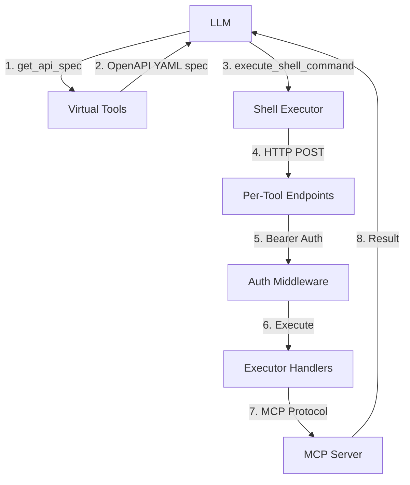

# Code Execution Agent Architecture

## Overview

The **Code Execution Agent** allows LLMs to write and execute code in **any language** (Python, bash, curl, Go, etc.) to interact with MCP tools via HTTP API endpoints. Instead of JSON-based tool calls, the LLM discovers tool endpoints through an OpenAPI spec and writes code that makes HTTP requests.

**Key Benefits:**
- **Language Agnostic**: Write code in Python, bash, curl, Go, or any language
- **OpenAPI-Based**: Standard REST API spec for tool discovery
- **Complex Logic**: Native loops, conditionals, data transformations
- **Tool Chaining**: Multiple tool calls in single execution
- **Bearer Token Auth**: Secure API access with auto-generated tokens

---

## Key Files & Locations

| Component | File Path | Key Functions |
|-----------|-----------|---------------|
| **Agent Core** | [`agent/agent.go`](../agent/agent.go) | `NewAgent()`, `WithCodeExecutionMode()`, `WithAPIConfig()` |
| **Virtual Tools** | [`agent/virtual_tools.go`](../agent/virtual_tools.go) | `get_api_spec` tool definition |
| **Code Execution Tools** | [`agent/code_execution_tools.go`](../agent/code_execution_tools.go) | `handleGetAPISpec()` |
| **OpenAPI Generator** | [`mcpcache/openapi/generator.go`](../mcpcache/openapi/generator.go) | `GenerateServerOpenAPISpec()` |
| **OpenAPI Schema** | [`mcpcache/openapi/schema.go`](../mcpcache/openapi/schema.go) | `JSONSchemaToOpenAPISchema()`, naming utilities |
| **Executor Handlers** | [`executor/handlers.go`](../executor/handlers.go) | `HandleMCPExecute()`, `HandleCustomExecute()` |
| **Per-Tool Handlers** | [`executor/per_tool_handler.go`](../executor/per_tool_handler.go) | `HandlePerToolMCPRequest()` |
| **Auth Middleware** | [`executor/security.go`](../executor/security.go) | `GenerateAPIToken()`, `AuthMiddleware()` |
| **Prompt Builder** | [`agent/prompt/builder.go`](../agent/prompt/builder.go) | `GetCodeExecutionInstructions()` |

---

## System Lifecycle

### 1. Initialization

```go
agent, err := mcpagent.NewAgent(
    ctx, llmModel, "", "config.json", "model-id",
    nil, "", nil,
    mcpagent.WithCodeExecutionMode(true),
    mcpagent.WithAPIConfig("http://127.0.0.1:8000", apiToken),
)
```

- In code execution mode, MCP tools are **excluded** from direct tool calls
- MCP tools are accessed via HTTP API endpoints instead
- Custom tools (e.g., `execute_shell_command`, workspace tools) remain as direct tool calls
- Virtual tool `get_api_spec` is registered for OpenAPI spec discovery

### 2. HTTP Server Setup (Consumer-Owned)

The consuming application owns the HTTP server and registers executor handlers:

```go
// Generate API token for bearer auth
apiToken := executor.GenerateAPIToken()

// Create executor handlers
handlers := executor.NewExecutorHandlers(configPath, logger)

// Create HTTP mux with per-tool endpoints
mux := http.NewServeMux()

// Batch endpoints (legacy)
mux.HandleFunc("/api/mcp/execute", handlers.HandleMCPExecute)
mux.HandleFunc("/api/custom/execute", handlers.HandleCustomExecute)

// Per-tool wildcard endpoints (used by OpenAPI spec)
mux.HandleFunc("/tools/mcp/", func(w http.ResponseWriter, r *http.Request) {
    path := strings.TrimPrefix(r.URL.Path, "/tools/mcp/")
    parts := strings.SplitN(path, "/", 2)
    if len(parts) != 2 || parts[0] == "" || parts[1] == "" {
        http.Error(w, `{"success":false,"error":"invalid path"}`, http.StatusBadRequest)
        return
    }
    server, tool := parts[0], parts[1]
    server = strings.ReplaceAll(server, "_", "-")
    tool = strings.ReplaceAll(tool, "_", "-")
    handlers.HandlePerToolMCPRequest(w, r, server, tool)
})

// Wrap with bearer token auth
authedHandler := executor.AuthMiddleware(apiToken)(mux)

server := &http.Server{Addr: "127.0.0.1:8000", Handler: authedHandler}
go server.ListenAndServe()
```

### 3. LLM Discovery via `get_api_spec`

The LLM calls `get_api_spec(server_name)` to retrieve the OpenAPI spec for a specific MCP server:

```
LLM: get_api_spec(server_name="google_sheets")
→ Returns OpenAPI 3.0 YAML with endpoints, schemas, and auth requirements
```

### 4. Code Execution Flow

1. LLM sees available servers and tool names in system prompt
2. LLM calls `get_api_spec("server_name")` → gets OpenAPI spec
3. LLM calls `execute_shell_command` to write and run code in any language
4. Code makes HTTP POST requests to per-tool endpoints documented in the spec
5. `MCP_API_URL` and `MCP_API_TOKEN` env vars are available in the execution environment

---

## Architecture Diagram



---

## OpenAPI Spec Generation

When `get_api_spec(server_name)` is called, an OpenAPI 3.0 YAML spec is generated on-demand from the MCP tool definitions:

**Example generated spec for `context7` server:**

```yaml
openapi: 3.0.3
info:
  title: context7 Tools API
  version: "1.0"
servers:
  - url: http://127.0.0.1:8000
security:
  - bearerAuth: []
paths:
  /tools/mcp/context7/resolve_library_id:
    post:
      operationId: context7__resolve_library_id
      summary: "Resolves a package/product name to a Context7-compatible library ID"
      requestBody:
        required: true
        content:
          application/json:
            schema:
              $ref: '#/components/schemas/ResolveLibraryIdRequest'
      responses:
        '200':
          $ref: '#/components/responses/ToolResponse'
  /tools/mcp/context7/query_docs:
    post:
      operationId: context7__query_docs
      summary: "Searches documentation for a library"
      requestBody:
        required: true
        content:
          application/json:
            schema:
              $ref: '#/components/schemas/QueryDocsRequest'
      responses:
        '200':
          $ref: '#/components/responses/ToolResponse'
components:
  securitySchemes:
    bearerAuth:
      type: http
      scheme: bearer
  schemas:
    ResolveLibraryIdRequest:
      type: object
      properties:
        libraryName:
          type: string
          description: "Library name to resolve"
      required:
        - libraryName
    QueryDocsRequest:
      type: object
      properties:
        libraryId:
          type: string
        query:
          type: string
      required:
        - libraryId
        - query
  responses:
    ToolResponse:
      description: Tool execution result
      content:
        application/json:
          schema:
            type: object
            properties:
              success:
                type: boolean
              result:
                type: string
              error:
                type: string
```

The spec is generated in-memory and cached on the agent after first generation. MCP tool `Function.Parameters` JSON Schema maps directly to OpenAPI request body schemas.

---

## Security

### Bearer Token Authentication

All API endpoints are secured with bearer token auth:

```go
// Generate a cryptographically random token
apiToken := executor.GenerateAPIToken() // 32-byte hex string

// Wrap HTTP handler with auth middleware
authedHandler := executor.AuthMiddleware(apiToken)(mux)
```

- Token is passed to the agent via `WithAPIConfig(baseURL, token)`
- Agent makes it available to code execution via `MCP_API_TOKEN` env var
- Missing or invalid tokens return HTTP 401

### Execution Isolation

- Code runs via `execute_shell_command` custom tool
- `MCP_API_URL` and `MCP_API_TOKEN` env vars available in execution environment
- Agent does not have direct access to MCP tool execution — only via HTTP API

---

## Configuration

### Environment Variables

| Variable | Default | Purpose |
|----------|---------|---------|
| `MCP_API_URL` | Set via `WithAPIConfig()` | API endpoint for HTTP tool calls |
| `MCP_API_TOKEN` | Set via `WithAPIConfig()` | Bearer token for API auth |

### Agent Options

```go
agent, err := mcpagent.NewAgent(
    ctx, llmModel, "", "config.json", "model-id",
    nil, "", nil,
    mcpagent.WithCodeExecutionMode(true),
    mcpagent.WithAPIConfig("http://127.0.0.1:8000", apiToken),
    mcpagent.WithLogger(logger),
)
```

---

## Common Issues & Solutions

| Issue | Cause | Solution |
|-------|-------|----------|
| `no tools found for server` | Server name mismatch | Use the exact server name from the tools index (underscores not hyphens) |
| `401 Unauthorized` | Missing/wrong bearer token | Ensure `WithAPIConfig()` token matches `AuthMiddleware()` token |
| `invalid path` on per-tool endpoint | Malformed URL path | URL should be `/tools/mcp/{server}/{tool}` |
| Empty OpenAPI spec | MCP server not connected | Ensure MCP server is connected and tools are discovered |
| `execute_shell_command` not found | Custom tool not registered | Register workspace tools in your application before creating the agent |

---

## For LLMs: Quick Reference

### Workflow

1. See available servers and tools in the system prompt index
2. Call `get_api_spec(server_name="...")` → get OpenAPI spec with endpoints + schemas
3. Use `execute_shell_command` to write and run code in any language
4. `MCP_API_URL` and `MCP_API_TOKEN` env vars are available in your execution environment
5. MCP tools are accessed via HTTP POST to per-tool endpoints documented in the OpenAPI spec

### Example: Python

```python
import requests
import os

url = os.environ["MCP_API_URL"]
token = os.environ["MCP_API_TOKEN"]

# Call resolve_library_id on context7 server
resp = requests.post(
    f"{url}/tools/mcp/context7/resolve_library_id",
    json={"libraryName": "react"},
    headers={"Authorization": f"Bearer {token}"}
)
print(resp.json())
```

### Example: curl

```bash
curl -X POST "$MCP_API_URL/tools/mcp/context7/resolve_library_id" \
  -H "Authorization: Bearer $MCP_API_TOKEN" \
  -H "Content-Type: application/json" \
  -d '{"libraryName": "react"}'
```

### Example: Go

```go
package main

import (
    "bytes"
    "encoding/json"
    "fmt"
    "net/http"
    "os"
)

func main() {
    apiURL := os.Getenv("MCP_API_URL")
    apiToken := os.Getenv("MCP_API_TOKEN")

    body, _ := json.Marshal(map[string]string{"libraryName": "react"})
    req, _ := http.NewRequest("POST", apiURL+"/tools/mcp/context7/resolve_library_id", bytes.NewReader(body))
    req.Header.Set("Authorization", "Bearer "+apiToken)
    req.Header.Set("Content-Type", "application/json")

    resp, err := http.DefaultClient.Do(req)
    if err != nil {
        fmt.Println("Error:", err)
        return
    }
    defer resp.Body.Close()

    var result map[string]interface{}
    json.NewDecoder(resp.Body).Decode(&result)
    fmt.Println(result)
}
```

---

## Related Documentation

- [`docs/mcp_cache_system.md`](./mcp_cache_system.md) - MCP server caching
- [`docs/folder_guard.md`](./folder_guard.md) - Fine-grained file access control
- [`docs/llm_resilience.md`](./llm_resilience.md) - Error handling
- [`agent/prompt/builder.go`](../agent/prompt/builder.go) - Code execution prompt instructions
