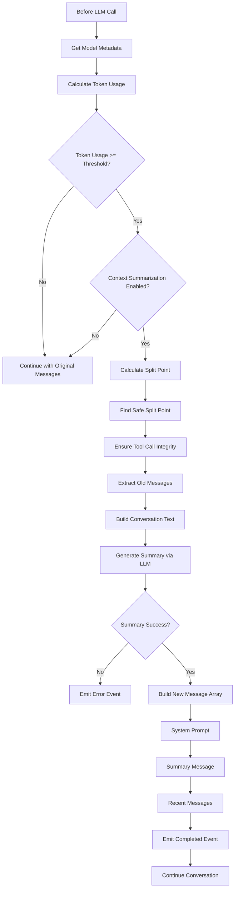

# Context Summarization

## 📋 Overview

Context Summarization automatically reduces conversation history when token usage exceeds a threshold percentage of the model's context window. It implements the "Summarize When Needed" pattern from context engineering best practices, allowing agents to maintain long-running conversations without exceeding LLM context window limits.

When enabled, the agent monitors token usage and uses an LLM to generate a concise summary of older conversation messages when the threshold is reached, while preserving recent messages intact. This summary is then inserted into the conversation as context, allowing the agent to continue with full awareness of previous interactions.

**Key Benefits:**
- Prevents context window overflow in long conversations
- Reduces token costs by compressing old history
- Maintains conversation continuity and context
- Preserves tool call/response integrity automatically
- Emits observability events for monitoring

---

## 📁 Key Files & Locations

| Component | File | Key Functions |
|-----------|------|---------------|
| **Core Logic** | [`context_summarization.go`](agent/context_summarization.go) | `rebuildMessagesWithSummary()`, `summarizeConversationHistory()`, `findSafeSplitPoint()`, `ensureToolCallResponseIntegrity()`, `ShouldSummarizeOnTokenThreshold()` |
| **Agent Configuration** | [`agent.go`](agent/agent.go) | `WithContextSummarization()`, `WithSummarizeOnTokenThreshold()`, `WithSummaryKeepLastMessages()` |
| **Conversation Integration** | [`conversation.go`](agent/conversation.go) | Token usage monitoring and summarization triggering |
| **Events** | [`events/data.go`](events/data.go) | `ContextSummarizationStartedEvent`, `ContextSummarizationCompletedEvent`, `ContextSummarizationErrorEvent` |

---

## 🔄 How It Works

### Automatic Summarization Flow

1. **Monitor**: Agent monitors token usage for each LLM call
2. **Check Threshold**: Before each LLM call, agent checks if token usage exceeds either:
   - The percentage threshold (e.g., 70% of context window) if `SummarizeOnTokenThreshold` is enabled
   - The fixed token threshold (e.g., 200k tokens) if `SummarizeOnFixedTokenThreshold` is enabled
3. **Trigger**: When token usage exceeds either threshold, summarization is triggered (OR logic: either threshold can trigger)
4. **Validate**: Agent checks if `EnableContextSummarization` is enabled and at least one threshold option is enabled
5. **Split**: Messages are split into:
   - **Old messages**: To be summarized (everything except the last N messages)
   - **Recent messages**: To keep intact (last N messages, default: 8)
6. **Safe Split**: `findSafeSplitPoint()` ensures tool call/response pairs are not broken
7. **Summarize**: Old messages are converted to text and sent to LLM with a summarization prompt
8. **Rebuild**: New message array is constructed:
   - System prompt (if exists)
   - Summary message (as user message with formatted summary)
   - Recent messages (unchanged)
9. **Continue**: Conversation continues with reduced message count

### Manual Summarization

External callers (e.g., HTTP API endpoints) can trigger summarization manually using:

```go
summarizedMessages, err := mcpagent.SummarizeConversationHistory(
    agent, ctx, messages, keepLastMessages)
```

### Tool Call/Response Integrity

The system ensures that tool calls and their responses are never split across the summary boundary:

- **`findSafeSplitPoint()`**: Works backwards from desired split point to find tool calls that need their responses
- **`ensureToolCallResponseIntegrity()`**: Double-checks that tool calls in the "old" section have all their responses in the "old" section, and tool responses in the "recent" section have their tool calls in the "recent" section

---

## 🏗️ Architecture



---

## ⚙️ Configuration

### Agent Options

| Option | Type | Default | Purpose |
|-------|------|---------|---------|
| `WithContextSummarization(enabled)` | `bool` | `false` | Enable/disable context summarization feature |
| `WithSummarizeOnTokenThreshold(enabled, thresholdPercent)` | `bool, float64` | `false, 0.7` | Enable token-based summarization with threshold percentage (0.0-1.0, e.g., 0.7 = 70%) |
| `WithSummarizeOnFixedTokenThreshold(enabled, thresholdTokens)` | `bool, int` | `false, 0` | Enable fixed token-based summarization with absolute threshold (e.g., 200000 = 200k tokens, regardless of context window size) |
| `WithSummaryKeepLastMessages(count)` | `int` | `4` | Number of recent messages to keep when summarizing |

### Constants

| Constant | Value | Purpose |
|----------|-------|---------|
| `DefaultSummaryKeepLastMessages` | `4` | Default number of recent messages to keep (roughly 2 turns) |

### Example Configuration

**Percentage-based threshold:**
```go
agent, err := mcpagent.NewAgent(
    ctx, llmModel, "", "config.json", "model-id",
    nil, "", nil,
    // Enable context summarization
    mcpagent.WithContextSummarization(true),
    // Automatically summarize when token usage reaches 70% of context window
    mcpagent.WithSummarizeOnTokenThreshold(true, 0.7),
    // Keep last 10 messages intact (instead of default 8)
    mcpagent.WithSummaryKeepLastMessages(10),
)
```

**Fixed token threshold:**
```go
agent, err := mcpagent.NewAgent(
    ctx, llmModel, "", "config.json", "model-id",
    nil, "", nil,
    // Enable context summarization
    mcpagent.WithContextSummarization(true),
    // Automatically summarize when token usage reaches 200k tokens (regardless of context window size)
    mcpagent.WithSummarizeOnFixedTokenThreshold(true, 200000),
    // Keep last 10 messages intact (instead of default 8)
    mcpagent.WithSummaryKeepLastMessages(10),
)
```

**Both thresholds (OR logic - either can trigger):**
```go
agent, err := mcpagent.NewAgent(
    ctx, llmModel, "", "config.json", "model-id",
    nil, "", nil,
    // Enable context summarization
    mcpagent.WithContextSummarization(true),
    // Summarize at 70% of context window OR 200k tokens (whichever comes first)
    mcpagent.WithSummarizeOnTokenThreshold(true, 0.7),
    mcpagent.WithSummarizeOnFixedTokenThreshold(true, 200000),
    // Keep last 10 messages intact (instead of default 8)
    mcpagent.WithSummaryKeepLastMessages(10),
)
```

---

## 📊 Events

The system emits three types of events for observability:

### 1. ContextSummarizationStartedEvent

Emitted when summarization begins.

**Fields:**
- `original_message_count`: Total messages before summarization
- `keep_last_messages`: Number of messages to keep
- `desired_split_index`: Desired split point (may be adjusted for safety)

### 2. ContextSummarizationCompletedEvent

Emitted when summarization completes successfully.

**Fields:**
- `original_message_count`: Total messages before summarization
- `new_message_count`: Total messages after summarization
- `old_messages_count`: Number of messages that were summarized
- `recent_messages_count`: Number of messages kept intact
- `summary_length`: Length of generated summary (characters)
- `safe_split_index`: Actual split point used (may differ from desired)
- `desired_split_index`: Original desired split point
- `summary`: The generated summary text (optional, for observability)
- `prompt_tokens`: Token usage for summarization prompt
- `completion_tokens`: Token usage for summary generation
- `total_tokens`: Total tokens used
- `cache_tokens`: Cached tokens used (if supported by LLM)
- `reasoning_tokens`: Reasoning tokens used (for models like GPT-5.1)

### 3. ContextSummarizationErrorEvent

Emitted when summarization fails.

**Fields:**
- `error`: Error message describing what went wrong
- `original_message_count`: Total messages before summarization attempt
- `keep_last_messages`: Number of messages that would have been kept

---

## 🧩 Example

### Automatic Summarization

```go
// Create agent with context summarization enabled
agent, err := mcpagent.NewAgent(
    ctx, llmModel, "", "config.json", openai.ModelGPT41,
    nil, "", nil,
    mcpagent.WithContextSummarization(true),
    // Summarize when token usage reaches 50% of context window
    mcpagent.WithSummarizeOnTokenThreshold(true, 0.5),
    mcpagent.WithSummaryKeepLastMessages(8),
)

// Long conversation that accumulates tokens
messages := []llmtypes.MessageContent{...} // 50+ messages
response, err := agent.AskWithHistory(ctx, "Continue the task", messages)

// When token usage exceeds threshold (e.g., 50% of 128k = 64k tokens):
// 1. Agent retrieves model metadata to get context window size
// 2. Calculates current token usage percentage
// 3. Old messages (first 42) are summarized
// 4. Recent messages (last 8) are kept intact
// 5. Summary is inserted as context
// 6. Conversation continues with reduced message count
```

### Manual Summarization

```go
// Manually trigger summarization
messages := []llmtypes.MessageContent{...} // 100 messages
keepLast := 10

summarizedMessages, err := mcpagent.SummarizeConversationHistory(
    agent, ctx, messages, keepLast)

// Result:
// - First 90 messages summarized into one summary message
// - Last 10 messages kept intact
// - Total: ~11 messages (system + summary + 10 recent)
```

### Summary Message Format

The summary is inserted into the conversation as a user message with this structured format:

```text
=== CONVERSATION SUMMARY (Previous N messages) ===

This session is being continued from a previous conversation that ran out of context. The conversation is summarized below:

**Analysis:**
Let me analyze the conversation chronologically:
[Chronological narrative of what happened in the conversation]

**Summary:**

1. **Primary Request and Intent:**
   - [Main goals and sub-tasks]

2. **Key Technical Concepts:**
   - [Important technical terms and patterns discussed]

3. **Files and Code Sections:**
   - [File paths with descriptions and line numbers]
   - [Code snippets that were written or modified]

4. **Errors and Fixes:**
   - [Errors encountered, root causes, and resolutions]

5. **Problem Solving:**
   - [Key insights and approaches that worked or didn't]

6. **All User Messages:**
   - [Chronological list of user requests as quotes/paraphrases]

7. **Pending Tasks:**
   - [Incomplete tasks and TODOs]

8. **Current Work:**
   - [What was being worked on and its state]

9. **Optional Next Step:**
   - [Suggested next action with direct quote from user if relevant]

Please continue the conversation from where we left it off without asking the user any further questions. Continue with the last task that you were asked to work on.

=== END SUMMARY ===
```

This structured format ensures the AI agent can seamlessly continue the conversation with full context awareness.

---

## 🛠️ Common Issues & Solutions

| Issue | Cause | Solution |
|-------|-------|----------|
| `empty summary generated` | LLM returned empty response | Check LLM provider status, ensure valid API key, verify model supports text generation |
| `failed to generate conversation summary` | LLM API call failed | Check network connectivity, verify API credentials, check rate limits |
| `model metadata not available` | Model metadata lookup failed | Verify model ID is correct, check that provider supports `GetModelMetadata()`, ensure model is in metadata registry |
| Tool calls/responses split incorrectly | Split point calculation error | The `findSafeSplitPoint()` and `ensureToolCallResponseIntegrity()` functions should prevent this. If it occurs, check message structure |
| Summary too verbose | Default prompt generates long summaries | Customize `buildSummarizationPrompt()` in [`context_summarization.go:179`](agent/context_summarization.go#L179) |
| Not summarizing when expected | Configuration not enabled or threshold too high | Ensure `WithContextSummarization(true)` is set and at least one threshold option is enabled (`WithSummarizeOnTokenThreshold` or `WithSummarizeOnFixedTokenThreshold`). Lower threshold values if summarization should trigger earlier |
| Too many/few messages kept | `keepLastMessages` value incorrect | Adjust `WithSummaryKeepLastMessages()` value. Default is 8 (roughly 3-4 turns) |
| Summarization triggers too early/late | Threshold value incorrect | For percentage-based: Adjust `WithSummarizeOnTokenThreshold()` threshold value. Lower values (0.3-0.5) trigger earlier, higher values (0.7-0.9) trigger later. For fixed threshold: Adjust `WithSummarizeOnFixedTokenThreshold()` token count (e.g., 100000 for 100k tokens) |
| Need absolute token limit regardless of model | Percentage threshold varies by model context window | Use `WithSummarizeOnFixedTokenThreshold(true, thresholdTokens)` to set an absolute token limit that works across all models |

---

## 🔍 For LLMs: Quick Reference

### Constraints

- ✅ **Allowed**: 
  - Modifying `keepLastMessages` value
  - Adjusting token threshold percentage (via `WithSummarizeOnTokenThreshold()`)
  - Customizing summarization prompt
  - Manually triggering summarization via `SummarizeConversationHistory()`
  - Adjusting temperature for summarization (currently 0 for deterministic summaries)

- ❌ **Forbidden**:
  - Modifying `findSafeSplitPoint()` logic without ensuring tool call integrity
  - Removing system prompt from message array
  - Summarizing recent messages (only old messages should be summarized)
  - Breaking tool call/response pairs across summary boundary
  - Bypassing model metadata lookup (required for token threshold calculation)

### Key Functions

**Core Functions:**
- `rebuildMessagesWithSummary()`: Main function that orchestrates the summarization process
- `summarizeConversationHistory()`: Generates summary using LLM
- `findSafeSplitPoint()`: Finds split point that preserves tool call integrity
- `ensureToolCallResponseIntegrity()`: Validates and adjusts split point

**Helper Functions:**
- `buildConversationTextForSummarization()`: Converts messages to text format
- `buildSummarizationPrompt()`: Creates the prompt for summarization LLM
- `extractMessageContent()`: Extracts text from message parts
- `getRoleLabel()`: Converts role to human-readable label

**Configuration Functions:**
- `ShouldSummarizeOnTokenThreshold()`: Checks if token usage exceeds threshold and summarization should occur
- `GetSummaryKeepLastMessages()`: Returns number of messages to keep

### Example: Custom Summarization Prompt

```go
// In context_summarization.go, modify buildSummarizationPrompt():
func buildSummarizationPrompt(conversationText string) string {
    return `You are a conversation summarizer. Create a concise summary that preserves:
    
1. Key decisions and conclusions
2. Important file paths and tool names
3. Errors and resolutions
4. Open tasks/TODOs

Keep the summary under 500 words.`
}
```

### Token Usage Tracking

The system tracks comprehensive token usage:
- **Prompt tokens**: Input tokens for summarization request
- **Completion tokens**: Output tokens for generated summary
- **Total tokens**: Sum of prompt + completion
- **Cache tokens**: Cached tokens (if LLM supports caching)
- **Reasoning tokens**: Reasoning tokens (for models like GPT-5.1)

All token metrics are included in `ContextSummarizationCompletedEvent` for observability.

---

## 📖 Related Documentation

- [Token Usage Tracking](token-usage-tracking.md) - How token usage is tracked across the system
- [Large Output Handling](large_output_handling.md) - Context offloading for large tool outputs (different from context summarization)
- [LLM Resilience](llm_resilience.md) - Error handling and retry logic for LLM calls
- [Event Type Generation](event_type_generation.md) - How events are generated and structured

---

## Summary

Context Summarization maintains long-running conversations without exceeding context window limits. It automatically summarizes old conversation history when token usage exceeds a threshold percentage of the model's context window, while preserving recent messages and ensuring tool call/response integrity. The system emits comprehensive events for observability and supports both automatic and manual summarization.

**Key Points:**
- Enabled via `WithContextSummarization(true)` and at least one threshold option:
  - `WithSummarizeOnTokenThreshold(true, thresholdPercent)` - Percentage-based (e.g., 70% of context window)
  - `WithSummarizeOnFixedTokenThreshold(true, thresholdTokens)` - Fixed token threshold (e.g., 200k tokens)
- Both thresholds can be enabled simultaneously (OR logic: either can trigger summarization)
- Default percentage threshold is 70% of context window (configurable via `WithSummarizeOnTokenThreshold()`)
- Default keeps last 4 messages (configurable via `WithSummaryKeepLastMessages()`)
- Automatically preserves tool call/response pairs
- Emits events for monitoring and debugging
- Tracks comprehensive token usage metrics
- Uses model metadata to determine context window size dynamically (for percentage-based threshold)

