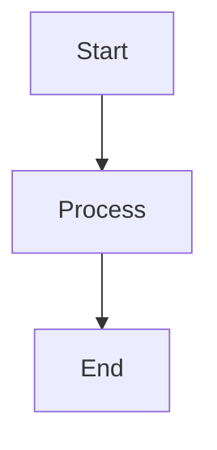
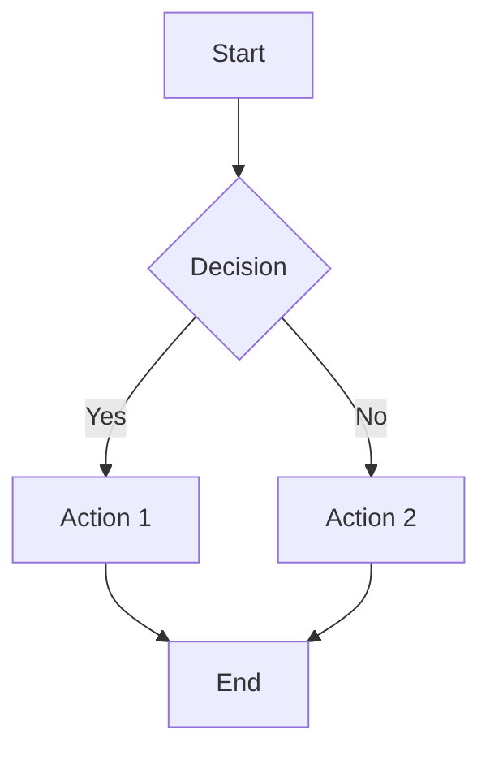
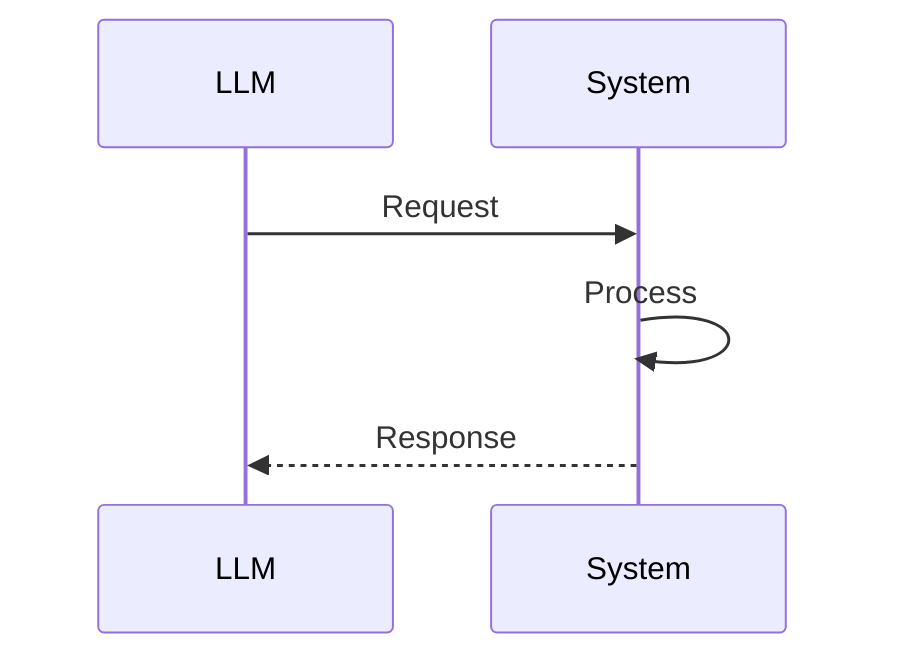
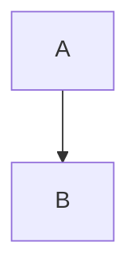

# Documentation Writing Guide

## Purpose

This guide defines standards for writing technical documentation in this codebase. Our docs are primarily consumed by **LLMs** (Large Language Models) to understand the system architecture, so they must be:

1. **Comprehensive** - Complete context for understanding
2. **Concise** - No unnecessary verbosity
3. **Scannable** - Easy to find specific information
4. **Actionable** - Practical examples and file references

---

## Target Audience

**Primary:** LLMs analyzing code and architecture  
**Secondary:** Human developers onboarding or debugging

LLMs need:
- Explicit file paths with clickable links
- Clear data flows and relationships
- Real code examples (not simplified pseudocode)
- Tables for quick reference
- Function/type names exactly as they appear in code

---

## Document Structure

### Essential Sections (in order)

1. **Overview** (1-2 paragraphs)
   - What is this component/system?
   - Why does it exist? (1-2 key benefits)

2. **Key Files & Locations** (table format)
   - All relevant files with absolute paths
   - Key functions/exports for each file
   - Use file links: `[filename](file:///absolute/path)`

3. **System Lifecycle/Flow**
   - Step-by-step how the system works
   - Use numbered lists or phases
   - Include what happens at each step

4. **Architecture Diagram** (if applicable)
   - Mermaid diagrams for visual learners
   - Show data flow, not just structure

5. **Code Examples**
   - Real implementation, not simplified
   - Show actual generated/used code
   - Include both input and output

6. **Configuration** (if applicable)
   - Environment variables (table)
   - Configuration options
   - Defaults clearly stated

7. **Common Issues & Solutions** (table)
   - Issue → Cause → Solution format
   - Link to relevant files for fixing

8. **For LLMs: Quick Reference**
   - Constraints and rules
   - Example template code
   - Common patterns

9. **Related Documentation**
   - Links to other relevant docs
   - Brief description of each

---

## Writing Guidelines

### ✅ DO

**Use Tables for Reference Information**
```markdown
| File | Purpose | Key Functions |
|------|---------|---------------|
| [`path/to/file.go`](file:///absolute/path) | Description | `FuncA()`, `FuncB()` |
```

**Use Explicit File Paths**
```markdown
**File:** [`mcpagent/agent/agent.go`](../agent/agent.go)
```

**Show Real Code**
```markdown
// From actual generated code:
func CreateSpreadsheet(params CreateSpreadsheetParams) (string, error) {
    payload := map[string]interface{}{
        "server": "google-sheets",
        "tool": "create_spreadsheet",
        "args": params,
    }
    return callAPI("/api/mcp/execute", payload)
}
```

**Use Diagrams for Flow**
```markdown

```

**Format Constraints as Lists**
```markdown
✅ **Allowed:**
- Relative paths
- Standard imports

❌ **Forbidden:**
- Absolute paths
- Direct OS calls
```

**Keep Examples Minimal But Complete**
```markdown
package main

import "fmt"

func main() {
    fmt.Println("Complete working example")
}
```

### ❌ DON'T

**Avoid Redundant Sections**
```markdown
❌ Don't repeat the same information in multiple places
❌ Don't have both "Files" and "File Reference" sections
```

**Avoid Verbose Explanations**
```markdown
❌ "This function is responsible for the important task of validating..."
✅ "Validates code before execution"
```

**Don't Use Simplified Code**
```markdown
❌ func DoSomething() { /* implementation */ }
✅ func DoSomething() error {
    return actualImplementation()
}
```

**Avoid Missing File Paths**
```markdown
❌ "Located in the agent package"
✅ **File:** [`mcpagent/agent/agent.go`](file://...)
```

**Don't Overuse Prose**
```markdown
❌ Long paragraphs explaining concepts
✅ Bullet points and tables for facts
✅ Short paragraphs (2-3 sentences max)
```

---

## Length Guidelines

Target document length based on complexity:

| Component Complexity | Target Lines | Max Lines |
|---------------------|--------------|-----------|
| Simple utility/helper | 100-150 | 200 |
| Medium system/feature | 200-350 | 500 |
| Complex architecture | 300-500 | 700 |

**Rule of Thumb:** If your doc exceeds the max, you're being too verbose or covering too much scope.

---

## Formatting Standards

### Headers

```markdown
# Document Title (H1 - only one per doc)

## Major Section (H2)

### Subsection (H3)

#### Detail (H4 - use sparingly)
```

### Code Blocks

Always specify language:
```markdown
```go
func Example() {}
```

```json
{"key": "value"}
```

```bash
export VAR=value
```
```

### Links

**Internal file links:**
```markdown
[`filename.go`](file:///absolute/path/to/filename.go)
```

**Section links:**
```markdown
See [Security Model](#security--validation)
```

**External links:**
```markdown
[Go Documentation](https://golang.org/doc)
```

### Emphasis

- **Bold** for important terms, file names, or emphasis
- *Italic* for subtle emphasis (use sparingly)
- `Code formatting` for function names, variables, paths
- ✅ ❌ for allowed/forbidden items

### Lists

**Ordered lists** for sequential steps:
```markdown
1. First step
2. Second step
3. Third step
```

**Unordered lists** for options or features:
```markdown
- Feature A
- Feature B
- Feature C
```

---

## Table Best Practices

### File Reference Table
```markdown
| File | Purpose | Key Exports |
|------|---------|-------------|
| [`file.go`](path) | Brief description | `Func1()`, `Func2()` |
```

### Configuration Table
```markdown
| Variable | Default | Purpose |
|----------|---------|---------|
| `ENV_VAR` | `default` | What it controls |
```

### Issues Table
```markdown
| Issue | Cause | Solution |
|-------|-------|----------|
| Error message | Why it happens | How to fix |
```

### Constraints Table
```markdown
| Type | Allowed | Forbidden |
|------|---------|-----------|
| Imports | `fmt`, `strings` | `os/exec` |
```

---

## Code Example Guidelines

### Minimal Complete Examples

**Good Example:**
```go
package main

import (
    "fmt"
    "github.com/example/pkg"
)

func main() {
    result, err := pkg.DoSomething(pkg.Params{
        Field: "value",
    })
    if err != nil {
        fmt.Printf("Error: %v\n", err)
        return
    }
    fmt.Println(result)
}
```

**Bad Example (too simplified):**
```go
result := DoSomething()
// ... more code
```

### Show Real Generated Code

✅ Copy actual generated code from the system  
❌ Make up simplified examples

### Include Imports

Always show what needs to be imported:
```go
import (
    "fmt"
    "mcp-agent-builder-go/agent_go/generated/workspace_tools"
)
```

---

## Mermaid Diagram Guidelines

### Flow Diagrams
```markdown

```

### Sequence Diagrams
```markdown

```

**Keep diagrams:**
- Simple (5-10 nodes max)
- Focused on one flow
- Labeled clearly

---

## Section-Specific Guidelines

### Overview Section

**Template:**
```markdown
## 📋 Overview

[Component] is a [type] that [primary purpose]. 

**Key Benefits:**
- Benefit 1
- Benefit 2
- Benefit 3
```

**Length:** 3-5 sentences + 3-5 bullet points

### File Reference Section

**Template:**
```markdown
## 📁 Key Files & Locations

| Component | File Path | Key Functions |
|-----------|-----------|---------------|
| **Component Name** | [`path/file.go`](file:///path) | `Func()`, `Type` |
```

**Include:**
- All files an LLM needs to understand the component
- Key exports (functions, types, constants)
- Brief purpose in separate column

### Configuration Section

**Template:**
```markdown
## ⚙️ Configuration

### Environment Variables

| Variable | Default | Purpose |
|----------|---------|---------|
| `VAR_NAME` | `default_value` | What it controls |

### Code Configuration

```go
component := New(
    Option1(value),
    Option2(value),
)
```
```

### Common Issues Section

**Template:**
```markdown
## 🛠️ Common Issues & Solutions

| Issue | Cause | Solution |
|-------|-------|----------|
| `error message` | Why it happens | How to fix + file to check |
```

**Link to relevant files:**
```markdown
| Issue | File to Check |
|-------|---------------|
| Validation error | [`validator.go:123`](file:///path#L123) |
```

---

## Quick Checklist

Before submitting documentation:

- [ ] Overview is 1-2 paragraphs maximum
- [ ] All file paths are absolute and linked
- [ ] Code examples are real, not simplified
- [ ] Tables used for reference information
- [ ] Each major section has clear purpose
- [ ] No redundant sections
- [ ] Document is under max length guidelines
- [ ] Diagrams (if any) are clear and focused
- [ ] "For LLMs" section with constraints/examples
- [ ] Related docs linked at end
- [ ] Function names match actual code exactly
- [ ] Environment variables documented

---

## Examples

### Good Documentation Pattern

```markdown
## Component Name

### Overview
Brief 2-sentence description of what it does.

### Key Files
| File | Purpose |
|------|---------|
| [`file.go`](path) | Does X |

### How It Works
1. Step 1
2. Step 2
3. Step 3

### Example
```go
// Real working code
```

### Configuration
| Var | Default |
|-----|---------|
| `X` | `val` |
```

### Bad Documentation Pattern

```markdown
## Component Name

This component is a very important part of the system that handles
many different things. It was created because we needed to solve
several problems...

[Multiple paragraphs of history and rationale]

The component is located in the codebase somewhere in the package...

Here's a simplified example:
```go
DoThing() // does the thing
```
```

---

## Revision Guide

When updating existing docs:

1. **Check Length** - Is it over max guidelines? Cut verbosity.
2. **Add File Paths** - Are all files explicitly linked?
3. **Improve Tables** - Can any lists become scannable tables?
4. **Real Examples** - Are code examples from actual implementation?
5. **Remove Duplication** - Is anything said twice?
6. **LLM Section** - Does it have quick reference for LLMs?

---

## Template

Use this template for new documentation:

```markdown
# Component Name

## 📋 Overview

Brief description (2-3 sentences).

**Key Benefits:**
- Benefit 1
- Benefit 2

---

## 📁 Key Files & Locations

| Component | File | Key Functions |
|-----------|------|---------------|
| **Name** | [`file.go`](file:///path) | `Func1()`, `Type1` |

---

## 🔄 How It Works

1. Step 1
2. Step 2
3. Step 3

---

## 🏗️ Architecture



---

## 🧩 Example

**Input:**
```go
input code
```

**Output:**
```go
output code
```

---

## ⚙️ Configuration

| Variable | Default | Purpose |
|----------|---------|---------|
| `VAR` | `default` | Description |

---

## 🛠️ Common Issues

| Issue | Cause | Solution |
|-------|-------|----------|
| Error | Why | How to fix |

---

## 🔍 For LLMs: Quick Reference

**Constraints:**
- ✅ Allowed: X
- ❌ Forbidden: Y

**Example:**
```go
working example
```

---

## 📖 Related Documentation

- [Other Doc](path) - Description
```

---

## Summary

**Core Principle:** Write for LLMs to quickly understand the complete system with minimal verbosity.

- Use tables for reference data
- Show real code, not pseudocode  
- Link to all relevant files
- Keep it concise but complete
- Make it scannable
