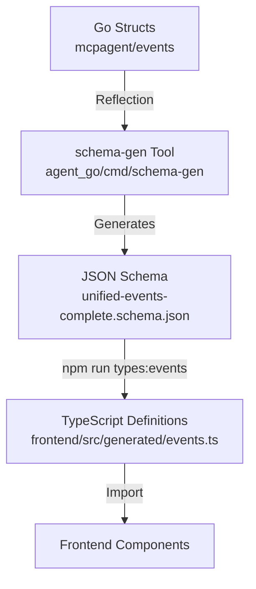

# Event Type Generation System

## 📋 Overview

The Event Type Generation System ensures type safety across the full stack by generating TypeScript definitions from Go backend structs. It uses a **Backend-to-Frontend** pipeline where Go structs are the single source of truth, converted first to JSON Schema, and then to TypeScript interfaces.

**Key Benefits:**
- **Type Safety**: Eliminates runtime errors due to mismatched event structures.
- **Single Source of Truth**: Go backend defines all event types.
- **Automation**: Automated pipeline from Go -> JSON Schema -> TypeScript.

---

## 📁 Key Files & Locations

| Component | File Path | Purpose |
|-----------|-----------|---------|
| **Source of Truth** | [`mcpagent/events/data.go`](file:///Users/mipl/ai-work/mcpagent/events/data.go) | Defines event structs (`ToolCallStartEvent`, etc.) |
| **Event Enums** | [`mcpagent/events/types.go`](file:///Users/mipl/ai-work/mcpagent/events/types.go) | Defines `EventType` constants |
| **Schema Generator** | [`agent_go/cmd/schema-gen/main.go`](file:///Users/mipl/ai-work/mcp-agent-builder-go/agent_go/cmd/schema-gen/main.go) | Go tool to generate JSON Schemas |
| **Frontend Config** | [`frontend/package.json`](file:///Users/mipl/ai-work/mcp-agent-builder-go/frontend/package.json) | NPM scripts for TS generation |
| **Generated Schema** | [`agent_go/schemas/unified-events-complete.schema.json`](file:///Users/mipl/ai-work/mcp-agent-builder-go/agent_go/schemas/unified-events-complete.schema.json) | Intermediate JSON Schema |
| **Generated TS** | [`frontend/src/generated/events.ts`](file:///Users/mipl/ai-work/mcp-agent-builder-go/frontend/src/generated/events.ts) | Final TypeScript definitions |

---

## 🔄 How It Works

1.  **Define Structs**: Developers define event structures in Go (`mcpagent/events/data.go`).
2.  **Generate Schema**: The `schema-gen` tool reflects over Go structs to create JSON Schemas.
3.  **Generate TypeScript**: Frontend scripts use `json-schema-to-typescript` to convert schemas to TS interfaces.
4.  **Consume Types**: Frontend components import generated types for type-safe event handling.

---

## 🏗️ Architecture



---

## 🧩 Example

**Input (Go Struct):**
```go
// From mcpagent/events/data.go
type ToolCallStartEvent struct {
    BaseEventData
    Turn       int        `json:"turn"`
    ToolName   string     `json:"tool_name"`
    ToolParams ToolParams `json:"tool_params"`
    ServerName string     `json:"server_name"`
}
```

**Intermediate (JSON Schema):**
```json
"ToolCallStartEvent": {
  "type": "object",
  "properties": {
    "turn": { "type": "integer" },
    "tool_name": { "type": "string" },
    ...
  },
  "required": ["turn", "tool_name"]
}
```

**Output (TypeScript):**
```typescript
// From frontend/src/generated/events.ts
export interface ToolCallStartEvent {
  timestamp: string;
  turn: number;
  tool_name: string;
  tool_params: ToolParams;
  server_name: string;
  [k: string]: unknown;
}
```

---

## ⚙️ Configuration

### NPM Scripts (`frontend/package.json`)

| Script | Command | Purpose |
|--------|---------|---------|
| `types:events` | `npx json-schema-to-typescript ...` | Generates main event types |
| `types:events-bridge` | `npx json-schema-to-typescript ...` | Generates polling event types |
| `types:generate` | `npm run types:events && ...` | Runs all generation scripts |

---

## 🛠️ Common Issues & Solutions

| Issue | Cause | Solution |
|-------|-------|----------|
| **Missing Field in TS** | Forgot to run generation | Run `npm run types:generate` in `frontend/` |
| **Type Mismatch** | Go struct tags incorrect | Check `json:"field_name"` tags in Go structs |
| **Schema Gen Fail** | Go compilation error | Fix Go code in `agent_go` before running generator |
| **Empty TS File** | Schema generation failed silently | Check `agent_go/schemas` for valid JSON content |

---

## 🔍 For LLMs: Quick Reference

**Adding a New Event Type:**

1.  **Define Go Struct**: Add struct to [`mcpagent/events/data.go`](file:///Users/mipl/ai-work/mcpagent/events/data.go).
2.  **Add to Union**: Add to `UnifiedEvent` in [`agent_go/cmd/schema-gen/main.go`](file:///Users/mipl/ai-work/mcp-agent-builder-go/agent_go/cmd/schema-gen/main.go).
3.  **Generate Schema**: Run `go run agent_go/cmd/schema-gen/main.go`.
4.  **Generate TS**: Run `cd frontend && npm run types:generate`.

**Constraints:**
- ✅ **Allowed**: Standard Go types, nested structs, `json` tags.
- ❌ **Forbidden**: `interface{}` (use specific types or `any` with caution), circular references.

---

## 📖 Related Documentation

- [Frontend Documentation](file:///Users/mipl/ai-work/mcp-agent-builder-go/frontend/README.md) - Frontend architecture
- [Backend Documentation](file:///Users/mipl/ai-work/mcp-agent-builder-go/agent_go/README.md) - Backend architecture
