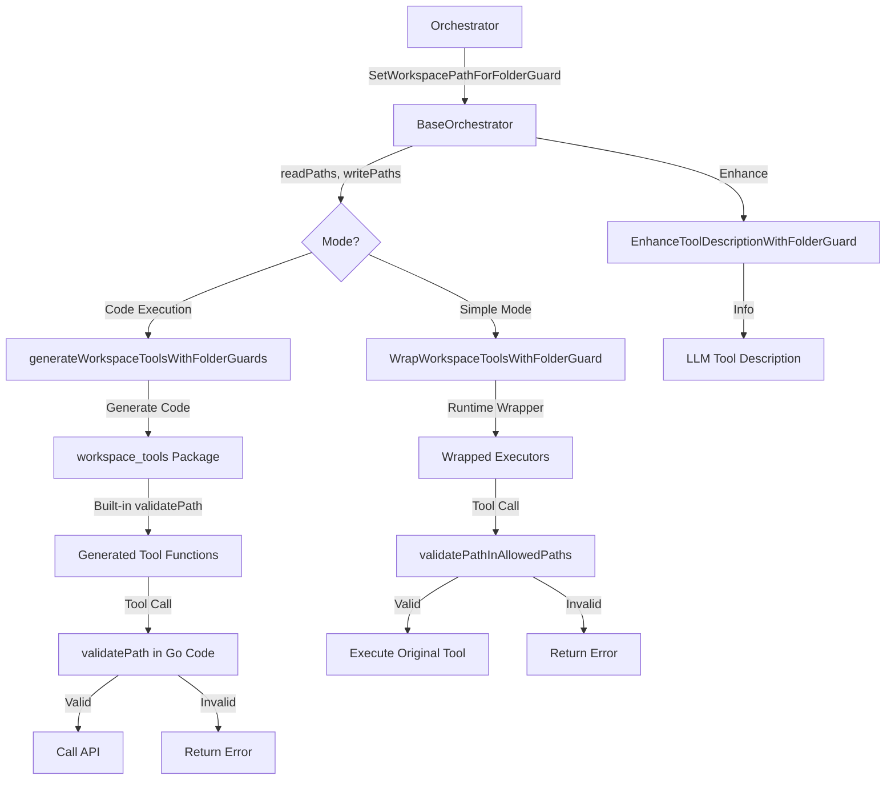

# Folder Guard System

## 📋 Overview

The folder guard system is a **fine-grained access control mechanism** that restricts agent file operations to specific directories. It provides security boundaries for both simple mode (runtime validation) and code execution mode (AST + runtime validation).

**Key Benefits:**
- Prevents agents from accessing unauthorized directories
- Supports separate read and write permission levels
- Automatically enhances tool descriptions with access restrictions
- Validates paths at both AST-level (code execution) and runtime (simple mode)
- Works seamlessly across workflow orchestration agents

---

## 📁 Key Files & Locations

| Component | File | Key Functions |
|-----------|------|---------------|
| **Base Orchestrator** | [`base_orchestrator.go`](../agent_go/pkg/orchestrator/base_orchestrator.go) | `SetWorkspacePathForFolderGuard()`, `GetFolderGuardPaths()`, `WrapWorkspaceToolsWithFolderGuard()`, `EnhanceToolDescriptionWithFolderGuard()`, `ShouldFilterWriteTool()` |
| **MCP Agent (Simple Mode)** | [`agent.go`](../agent/agent.go) | `SetFolderGuardPaths()`, `GetFolderGuardPaths()` |
| **Code Execution Mode** | [`code_execution_tools.go`](../agent/code_execution_tools.go) | `generatePathValidationHelper()`, `generateWorkspaceToolsWithFolderGuards()`, `validatePath()`, `isPathAllowed()` |
| **Validation Helpers** | [`base_orchestrator.go`](../agent_go/pkg/orchestrator/base_orchestrator.go) | `validatePathInWorkspace()`, `validatePathInAllowedPaths()`, `normalizePathForAllowedPaths()`, `normalizePathForWorkspace()` |

---

## 🔄 How It Works

### System Lifecycle

1. **Configuration Phase**
   - Orchestrator calls `SetWorkspacePathForFolderGuard(readPaths, writePaths)`
   - Empty arrays disable folder guard; non-empty arrays enable it
   - Paths are stored in `folderGuardReadPaths` and `folderGuardWritePaths`

2. **Tool Setup Phase (Simple Mode)**
   - Tools are wrapped using `WrapWorkspaceToolsWithFolderGuard()`
   - Each tool gets path validation logic injected
   - Tool descriptions enhanced via `EnhanceToolDescriptionWithFolderGuard()`
   - LLM receives explicit directory restrictions in tool descriptions

3. **Tool Setup Phase (Code Execution Mode)**
   - In code execution mode, MCP tools are accessed via HTTP API (per-tool endpoints)
   - Custom tools like `execute_shell_command` and workspace tools remain as direct tool calls
   - Folder guard validation applies to custom workspace tools at runtime
   - The LLM writes code in any language (Python, bash, etc.) that calls HTTP endpoints
   - Path validation for workspace operations is handled by the custom tool executors

4. **Runtime Validation (Simple Mode)**
   - Before tool execution, wrapper validates all path parameters
   - Validation checks: `validatePathInAllowedPaths(allowedPaths, pathStr)`
   - Read operations: allowed in both `readPaths` + `writePaths`
   - Write operations: allowed only in `writePaths`
   - Paths normalized to workspace-relative format

5. **Runtime Validation (Code Execution Mode)**
   - Custom workspace tools (e.g., `execute_shell_command`, `update_workspace_file`) validate paths at runtime
   - Folder guard paths are enforced by the custom tool executor before executing operations
   - The LLM accesses workspace tools as direct tool calls (not via HTTP API)

6. **Execution**
   - Validated paths passed to original tool executor
   - Invalid paths rejected with descriptive error messages
   - Downloads folder always accessible (special exception)

---

## 🏗️ Architecture



---

## 🧩 Example Usage

### Simple Mode Setup

**File:** [`controller.go`](../agent_go/pkg/orchestrator/agents/workflow/todo_creation_human/controller.go)

```go
// Set folder guard paths for execution agent
baseWorkspacePath := hcpo.GetWorkspacePath()
executionPath := fmt.Sprintf("%s/execution", baseWorkspacePath)
learningsPath := fmt.Sprintf("%s/learnings", baseWorkspacePath)

// Read paths: learnings (read-only)
readPaths := []string{learningsPath}

// Write paths: execution (read + write)
writePaths := []string{executionPath}

// Configure folder guard
hcpo.SetWorkspacePathForFolderGuard(readPaths, writePaths)

// Logs: 🔒 Folder guard enabled - Read paths: [/path/to/learnings], Write paths: [/path/to/execution]
```

### Code Execution Mode Setup

**File:** [`controller.go`](../agent_go/pkg/orchestrator/agents/workflow/todo_creation_human/controller.go)

```go
// Set folder guard paths on the agent
readPaths, writePaths := hcpo.GetFolderGuardPaths()
mcpAgent.SetFolderGuardPaths(readPaths, writePaths)
hcpo.GetLogger().Infof("Folder guard paths set - Read: %v, Write: %v", readPaths, writePaths)
```

In code execution mode, folder guard validation is enforced by the custom tool executors (e.g., `execute_shell_command`, `update_workspace_file`) at runtime, the same way as simple mode. The LLM accesses MCP tools via HTTP API endpoints (discovered through `get_api_spec`), while workspace tools remain as direct tool calls with folder guard enforcement.

### Runtime Validation Flow

**File:** [`base_orchestrator.go`](../agent_go/pkg/orchestrator/base_orchestrator.go)

```go
// Wrapper function created by WrapWorkspaceToolsWithFolderGuard
wrappedExecutor := func(ctx context.Context, args map[string]interface{}) (string, error) {
    // Determine allowed paths based on tool type
    var allowedPaths []string
    if isWrite {
        // Write tool: only writePaths
        allowedPaths = bo.folderGuardWritePaths
    } else if isReadOnly {
        // Read tool: readPaths + writePaths
        allowedPaths = append(bo.folderGuardReadPaths, bo.folderGuardWritePaths...)
    }

    // Validate all path parameters BEFORE execution
    for _, paramName := range paramsToValidate {
        if pathStr, ok := args[paramName].(string); ok {
            // Validate path
            if err := validatePathInAllowedPaths(allowedPaths, pathStr); err != nil {
                return "", err
            }
            
            // Normalize path
            normalizedPath, _, err := normalizePathForAllowedPaths(allowedPaths, pathStr)
            if err != nil {
                return "", err
            }
            args[paramName] = normalizedPath
        }
    }

    // All validations passed - execute tool
    return originalExecutor(ctx, args)
}
```

---

## ⚙️ Configuration

### Environment Impact

No environment variables directly control folder guard. Configuration is programmatic.

### Code Configuration

**Disable Folder Guard:**
```go
// Empty arrays disable folder guard
orchestrator.SetWorkspacePathForFolderGuard([]string{}, []string{})
// Logs: 🔓 Folder guard disabled (empty read/write paths)
```

**Read-Only Access:**
```go
// No write paths = read-only
readPaths := []string{"/workspace/learnings", "/workspace/planning"}
writePaths := []string{} // No write access
orchestrator.SetWorkspacePathForFolderGuard(readPaths, writePaths)
```

**Read + Write Access:**
```go
// Separate read and write paths
readPaths := []string{"/workspace/learnings"} // Read-only
writePaths := []string{"/workspace/execution"} // Read + write
orchestrator.SetWorkspacePathForFolderGuard(readPaths, writePaths)
```

**Special Access:**
- `Downloads/` folder always accessible regardless of folder guard settings
- Prevents directory traversal: `../` patterns rejected

### Tool Classification

| Tool Type | Allowed Paths |
|-----------|---------------|
| **Read Tools** | `readPaths` + `writePaths` (combined) |
| **Write Tools** | `writePaths` only |

**Read Tools:**
- `read_workspace_file`, `list_workspace_files`, `regex_search_workspace_files`, `semantic_search_workspace_files`, `execute_shell_command`, `read_image`

**Write Tools:**
- `update_workspace_file`, `diff_patch_workspace_file`, `delete_workspace_file`, `write_workspace_file`, `move_workspace_file`

**Filtered Tools:**
- Write tools automatically hidden from LLM if `len(folderGuardWritePaths) == 0`
- Prevents LLM from attempting impossible operations

---

## 🛠️ Common Issues & Solutions

| Issue | Cause | Solution |
|-------|-------|----------|
| `path is outside allowed boundaries` | Path not in configured `readPaths` or `writePaths` | Add path to appropriate array in `SetWorkspacePathForFolderGuard()` call |
| `path is not within any of the allowed paths: [only_readPaths]` (code execution mode) | Folder guard paths set AFTER `UpdateCodeExecutionRegistry()` | **CRITICAL:** Call `SetFolderGuardPaths()` BEFORE `UpdateCodeExecutionRegistry()` so generated code includes both readPaths and writePaths |
| Write tool missing from LLM | `folderGuardWritePaths` is empty | Add write paths via `SetWorkspacePathForFolderGuard(readPaths, writePaths)` |
| Folder guard not enforcing | Empty arrays passed | Pass non-empty arrays to enable: `SetWorkspacePathForFolderGuard(readPaths, writePaths)` |
| Code execution validation error | LLM bypassing workspace tools | Update system prompt to emphasize workspace tool usage for file operations |
| Path normalized incorrectly | Relative path ambiguity | Use absolute paths in `SetWorkspacePathForFolderGuard()` |
| Downloads folder rejected | Directory traversal attempt (../Downloads) | Remove `../` from path; use `Downloads/` directly |

---

## 🔍 For LLMs: Quick Reference

### Constraints

✅ **Allowed:**
- Paths within configured `readPaths` (read operations only)
- Paths within configured `writePaths` (read + write operations)
- `Downloads/` folder (always accessible, special exception)
- Relative paths resolved against workspace root

❌ **Forbidden:**
- Paths outside configured boundaries
- Directory traversal patterns (`../`, `..\\`)
- Write operations when `writePaths` is empty
- Direct file I/O in code execution mode (must use `workspace_tools`)

### Example Pattern (Simple Mode)

**Agent configuration in workflow orchestrator:**
```go
// Execution agent: read from learnings, write to execution
learningsPath := fmt.Sprintf("%s/learnings", workspacePath)
executionPath := fmt.Sprintf("%s/execution", workspacePath)

orchestrator.SetWorkspacePathForFolderGuard(
    []string{learningsPath},  // Read-only
    []string{executionPath},  // Read + write
)
```

**Tool descriptions automatically enhanced:**
```
📁 **DIRECTORY ACCESS RESTRICTIONS:**

⚠️ **IMPORTANT:** You can ONLY write to these directories:
/workspace/execution

✅ **SPECIAL ACCESS:** The 'Downloads/' folder is always accessible.

Use ONLY these directories (or Downloads/) when calling this tool.
```

### Example Pattern (Code Execution Mode)

In code execution mode, the LLM uses `execute_shell_command` and workspace custom tools directly. MCP tools are accessed via HTTP endpoints (discovered through `get_api_spec`). Folder guard validation applies to workspace tool calls:

```
LLM calls: update_workspace_file(filepath="execution/results.json", content="...")
→ Custom tool executor validates path against folder guard paths
→ ✅ Path is within writePaths → operation proceeds
→ ❌ Path outside writePaths → rejected with error
```

---

## 🔄 Session-Scoped Registry (Concurrent Workflows)

### The Problem

When multiple workflows run concurrently, they share a global custom tool registry. This causes **cross-workflow contamination**:

```
┌─────────────────────────────────────────────────────────────────┐
│                    GLOBAL REGISTRY (BEFORE FIX)                  │
│                                                                  │
│   customTools: {                                                │
│     "read_workspace_file": executor_with_B_paths  ← LAST WINS!  │
│     "list_workspace_files": executor_with_B_paths               │
│   }                                                             │
└─────────────────────────────────────────────────────────────────┘
```

**Sequence causing the bug:**
1. Workflow A sets folder guard paths → registers wrapped tools in global registry
2. Workflow B sets folder guard paths → **overwrites** A's tools with B's wrapped tools
3. Workflow A calls a tool → gets B's executor → uses B's folder guard paths → **ERROR**

### The Solution: Session-Scoped Registry

Each workflow uses a unique `SessionID`. Custom tools are registered per-session:

```
┌─────────────────────────────────────────────────────────────────┐
│                         REGISTRY (AFTER FIX)                     │
│                                                                  │
│  globalCustomTools: { ... }  ← fallback for backward compat     │
│                                                                  │
│  sessionCustomTools: {                                          │
│    "session-A": {                                               │
│      "read_workspace_file": executor_with_A_paths               │
│      "list_workspace_files": executor_with_A_paths              │
│    },                                                           │
│    "session-B": {                                               │
│      "read_workspace_file": executor_with_B_paths  ← isolated!  │
│      "list_workspace_files": executor_with_B_paths              │
│    }                                                            │
│  }                                                              │
└─────────────────────────────────────────────────────────────────┘
```

### Key Functions

| Function | File | Purpose |
|----------|------|---------|
| `InitRegistryForSession()` | `codeexec/registry.go` | Registers custom tools scoped to a session |
| `CallCustomToolWithSession()` | `codeexec/registry.go` | Looks up session-scoped tools first, falls back to global |
| `CleanupSession()` | `codeexec/registry.go` | Removes session-scoped tools when workflow completes |

### How It Works

1. **Agent Initialization**: When `UpdateCodeExecutionRegistry()` is called, tools are registered both globally (backward compat) and per-session
2. **Tool Execution**: Generated code passes `session_id` (from `MCP_SESSION_ID` env var) in API calls
3. **Registry Lookup**: `CallCustomToolWithSession()` checks session-scoped tools first, falls back to global
4. **Cleanup**: Call `CleanupSession(sessionID)` when workflow completes to free memory

### Usage

```go
// During agent initialization (automatic in UpdateCodeExecutionRegistry)
if a.SessionID != "" {
    codeexec.InitRegistryForSession(a.SessionID, customToolExecutors, a.Logger)
}

// During workflow cleanup (optional but recommended)
codeexec.CleanupSession(sessionID)
```

---

## 📖 Related Documentation

- [Code Execution Agent](./code_execution_agent.md) - Describes AST-level validation
- [Workspace Tools](./workspace_tools.md) - Virtual tools for file operations
- [Orchestrator Architecture](./orchestrator_architecture.md) - Workflow orchestration context
- [Session-Scoped MCP Connections](./session_scoped_mcp_connections.md) - Related session-scoping for MCP connections

---

## 🔒 Security Model

### Defense in Depth

**Layer 1: LLM Instruction** - Tool descriptions warn LLM about restrictions
**Layer 2: Runtime Validation** - Custom tool executors validate paths before execution (both simple and code execution modes)
**Layer 3: Bearer Token Auth (Code Execution)** - HTTP API endpoints secured with bearer token authentication  

### Path Resolution Rules

1. **Absolute paths**: Used as-is, validated against allowed paths
2. **Relative paths**: Resolved relative to workspace root, then validated
3. **Empty string or "."**: Normalized to workspace root (`""`)
4. **Downloads exception**: `Downloads/` always allowed (no `../` traversal)

### Validation Algorithm

```go
func validatePathInAllowedPaths(allowedPaths []string, inputPath string) error {
    // Empty allowedPaths = folder guard disabled
    if len(allowedPaths) == 0 {
        return nil
    }

    // Check each allowed path
    for _, allowedPath := range allowedPaths {
        if err := validatePathInWorkspace(allowedPath, inputPath); err == nil {
            return nil // Path is valid within this allowed path
        }
    }

    // Not valid within any allowed path
    return fmt.Errorf("path '%s' is not within any of the allowed paths: %v", inputPath, allowedPaths)
}
```

---

## 📊 Design Rationale

### Why Separate Read and Write Paths?

**Problem:** Agents often need to read reference data but write to different locations.

**Example:** Execution agent reads learnings (reference code/patterns) but writes outputs to execution folder.

**Solution:** `readPaths` for read-only access, `writePaths` for read+write access.

### Why Runtime Validation in Code Execution Mode?

**Problem:** LLM-written code could attempt file operations outside allowed directories.

**Solution:** Custom workspace tools (e.g., `update_workspace_file`, `execute_shell_command`) validate paths at runtime before executing operations, same as simple mode. MCP tools are accessed via HTTP API and don't involve direct file operations.

---

## 🎯 Common Workflow Patterns

### Pattern 1: Execution Agent (Read Learnings, Write Execution)

```go
learningsPath := fmt.Sprintf("%s/learnings", workspacePath)
executionPath := fmt.Sprintf("%s/execution", workspacePath)
orchestrator.SetWorkspacePathForFolderGuard(
    []string{learningsPath},  // Read learning files
    []string{executionPath},  // Write execution outputs
)
```

### Pattern 2: Planning Agent (Read Learnings, Write Planning)

```go
planningPath := fmt.Sprintf("%s/planning", workspacePath)
learningsPath := fmt.Sprintf("%s/learnings", workspacePath)
orchestrator.SetWorkspacePathForFolderGuard(
    []string{learningsPath},      // Read learning files
    []string{planningPath},        // Write plan files
)
```

### Pattern 3: Validation Agent (Read Execution, Write Validation)

```go
executionPath := fmt.Sprintf("%s/execution", workspacePath)
validationPath := fmt.Sprintf("%s/validation", workspacePath)
orchestrator.SetWorkspacePathForFolderGuard(
    []string{executionPath},      // Read execution outputs
    []string{validationPath},     // Write validation reports
)
```

### Pattern 4: Read-Only Agent (No Writes)

```go
learningsPath := fmt.Sprintf("%s/learnings", workspacePath)
orchestrator.SetWorkspacePathForFolderGuard(
    []string{learningsPath},  // Read-only access
    []string{},               // No write access
)
// Write tools automatically filtered from LLM
```
