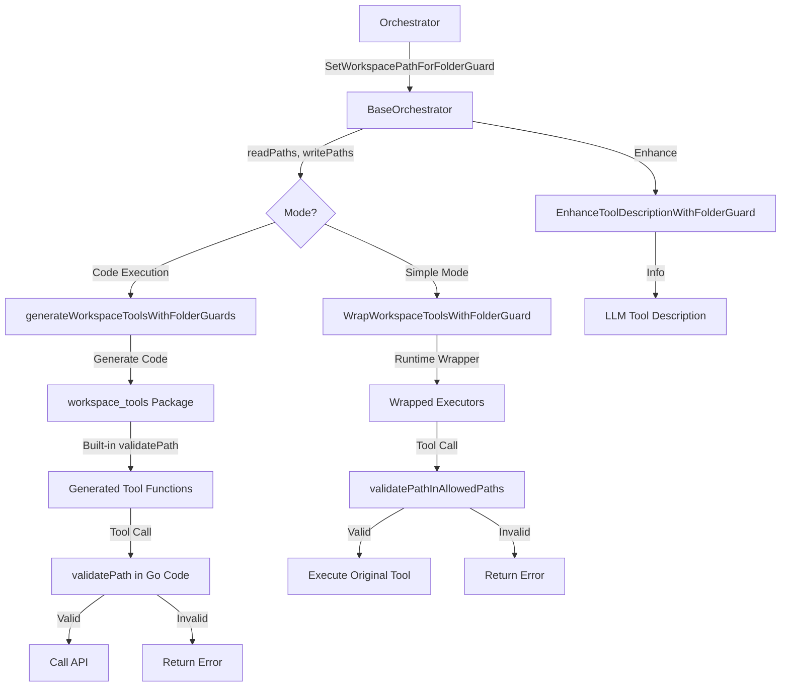

# Folder Guard System

## 📋 Overview

The folder guard system is a **fine-grained access control mechanism** that restricts agent file operations to specific directories. It provides security boundaries for both simple mode (runtime validation) and code execution mode (AST + runtime validation).

**Key Benefits:**
- Prevents agents from accessing unauthorized directories
- Supports separate read and write permission levels
- Automatically enhances tool descriptions with access restrictions
- Validates paths at both AST-level (code execution) and runtime (simple mode)
- Works seamlessly across workflow orchestration agents

---

## 📁 Key Files & Locations

| Component | File | Key Functions |
|-----------|------|---------------|
| **Base Orchestrator** | [`base_orchestrator.go`](file:///Users/mipl/ai-work/mcp-agent-builder-go/agent_go/pkg/orchestrator/base_orchestrator.go) | `SetWorkspacePathForFolderGuard()`, `GetFolderGuardPaths()`, `WrapWorkspaceToolsWithFolderGuard()`, `EnhanceToolDescriptionWithFolderGuard()`, `ShouldFilterWriteTool()` |
| **MCP Agent (Simple Mode)** | [`agent.go`](file:///Users/mipl/ai-work/mcpagent/agent/agent.go) | `SetFolderGuardPaths()`, `GetFolderGuardPaths()` |
| **Code Execution Mode** | [`code_execution_tools.go`](file:///Users/mipl/ai-work/mcpagent/agent/code_execution_tools.go) | `generatePathValidationHelper()`, `generateWorkspaceToolsWithFolderGuards()`, `validatePath()`, `isPathAllowed()` |
| **Validation Helpers** | [`base_orchestrator.go`](file:///Users/mipl/ai-work/mcp-agent-builder-go/agent_go/pkg/orchestrator/base_orchestrator.go) | `validatePathInWorkspace()`, `validatePathInAllowedPaths()`, `normalizePathForAllowedPaths()`, `normalizePathForWorkspace()` |

---

## 🔄 How It Works

### System Lifecycle

1. **Configuration Phase**
   - Orchestrator calls `SetWorkspacePathForFolderGuard(readPaths, writePaths)`
   - Empty arrays disable folder guard; non-empty arrays enable it
   - Paths are stored in `folderGuardReadPaths` and `folderGuardWritePaths`

2. **Tool Setup Phase (Simple Mode)**
   - Tools are wrapped using `WrapWorkspaceToolsWithFolderGuard()`
   - Each tool gets path validation logic injected
   - Tool descriptions enhanced via `EnhanceToolDescriptionWithFolderGuard()`
   - LLM receives explicit directory restrictions in tool descriptions

3. **Tool Setup Phase (Code Execution Mode)**
   - **CRITICAL:** Folder guard paths must be set on MCP agent BEFORE calling `UpdateCodeExecutionRegistry()`
   - The registry generation uses these paths to create the path validation code
   - Agent-specific `workspace_tools` package generated with embedded folder guards
   - Generated code includes `validatePath()` and `isPathAllowed()` functions
   - Folder guard paths compiled into Go code as `folderGuardReadPaths` and `folderGuardWritePaths` variables
   - AST validation prevents forbidden file I/O operations (os.WriteFile, etc.)

4. **Runtime Validation (Simple Mode)**
   - Before tool execution, wrapper validates all path parameters
   - Validation checks: `validatePathInAllowedPaths(allowedPaths, pathStr)`
   - Read operations: allowed in both `readPaths` + `writePaths`
   - Write operations: allowed only in `writePaths`
   - Paths normalized to workspace-relative format

5. **Runtime Validation (Code Execution Mode)**  
   - Generated workspace tool functions call `validatePath(path, isWrite)` before API calls
   - AST parser prevents direct file I/O (blocks os.WriteFile, os.Open, etc.)
   - Validation embedded in generated Go code (no runtime wrapper needed)
   - LLM must use `workspace_tools.UpdateWorkspaceFile()` instead of `os.WriteFile()`

6. **Execution**
   - Validated paths passed to original tool executor
   - Invalid paths rejected with descriptive error messages
   - Downloads folder always accessible (special exception)

---

## 🏗️ Architecture



---

## 🧩 Example Usage

### Simple Mode Setup

**File:** [`controller.go`](file:///Users/mipl/ai-work/mcp-agent-builder-go/agent_go/pkg/orchestrator/agents/workflow/todo_creation_human/controller.go)

```go
// Set folder guard paths for execution agent
baseWorkspacePath := hcpo.GetWorkspacePath()
executionPath := fmt.Sprintf("%s/execution", baseWorkspacePath)
learningsPath := fmt.Sprintf("%s/learnings", baseWorkspacePath)

// Read paths: learnings (read-only)
readPaths := []string{learningsPath}

// Write paths: execution (read + write)
writePaths := []string{executionPath}

// Configure folder guard
hcpo.SetWorkspacePathForFolderGuard(readPaths, writePaths)

// Logs: 🔒 Folder guard enabled - Read paths: [/path/to/learnings], Write paths: [/path/to/execution]
```

### Code Execution Mode Setup

**File:** [`controller.go`](file:///Users/mipl/ai-work/mcp-agent-builder-go/agent_go/pkg/orchestrator/agents/workflow/todo_creation_human/controller.go)

```go
// CRITICAL: Set folder guard paths BEFORE updating code execution registry
// The registry generation uses these paths to create the path validation code
readPaths, writePaths := hcpo.GetFolderGuardPaths()
mcpAgent.SetFolderGuardPaths(readPaths, writePaths)
hcpo.GetLogger().Infof("🔒 [CODE_EXECUTION] Folder guard paths set - Read: %v, Write: %v", readPaths, writePaths)

// Now update the code execution registry (generates workspace_tools with embedded paths)
if err := mcpAgent.UpdateCodeExecutionRegistry(); err != nil {
    return fmt.Errorf("failed to update code execution registry: %w", err)
}

// Logs: 
// 🔒 [CODE_EXECUTION] Folder guard paths set - Read: [/workspace/learnings], Write: [/workspace/execution]
// ✅ [CODE_EXECUTION] Registry updated for agent - folder guard enabled
```

### Generated Code Example (Code Execution Mode)

**File:** Generated `workspace_tools/path_validation.go`

```go
package workspace_tools

// Folder guard paths embedded at code generation time
var folderGuardReadPaths = []string{"/workspace/learnings", "/workspace/planning"}
var folderGuardWritePaths = []string{"/workspace/execution"}

// validatePath validates a path against folder guard restrictions
func validatePath(path string, isWrite bool) error {
    var allowedPaths []string
    if isWrite {
        allowedPaths = folderGuardWritePaths
    } else {
        // Read operations can use both read and write paths
        allowedPaths = append(folderGuardReadPaths, folderGuardWritePaths...)
    }

    if !isPathAllowed(path, allowedPaths) {
        opType := "read"
        if isWrite {
            opType = "write"
        }
        return fmt.Errorf("path %q is outside allowed %s boundaries (allowed: %v)", path, opType, allowedPaths)
    }

    return nil
}
```

**File:** Generated `workspace_tools/update_workspace_file.go`

```go
func UpdateWorkspaceFile(params UpdateWorkspaceFileParams) (string, error) {
    // Validate filepath path (BEFORE converting to map)
    if params.Filepath != "" {
        if err := validatePath(params.Filepath, true); err != nil {
            return "", err
        }
    }

    // Convert params struct to map for API call
    paramsBytes, err := json.Marshal(params)
    // ... rest of API call logic
}
```

### Runtime Validation Flow

**File:** [`base_orchestrator.go`](file:///Users/mipl/ai-work/mcp-agent-builder-go/agent_go/pkg/orchestrator/base_orchestrator.go)

```go
// Wrapper function created by WrapWorkspaceToolsWithFolderGuard
wrappedExecutor := func(ctx context.Context, args map[string]interface{}) (string, error) {
    // Determine allowed paths based on tool type
    var allowedPaths []string
    if isWrite {
        // Write tool: only writePaths
        allowedPaths = bo.folderGuardWritePaths
    } else if isReadOnly {
        // Read tool: readPaths + writePaths
        allowedPaths = append(bo.folderGuardReadPaths, bo.folderGuardWritePaths...)
    }

    // Validate all path parameters BEFORE execution
    for _, paramName := range paramsToValidate {
        if pathStr, ok := args[paramName].(string); ok {
            // Validate path
            if err := validatePathInAllowedPaths(allowedPaths, pathStr); err != nil {
                return "", err
            }
            
            // Normalize path
            normalizedPath, _, err := normalizePathForAllowedPaths(allowedPaths, pathStr)
            if err != nil {
                return "", err
            }
            args[paramName] = normalizedPath
        }
    }

    // All validations passed - execute tool
    return originalExecutor(ctx, args)
}
```

---

## ⚙️ Configuration

### Environment Impact

No environment variables directly control folder guard. Configuration is programmatic.

### Code Configuration

**Disable Folder Guard:**
```go
// Empty arrays disable folder guard
orchestrator.SetWorkspacePathForFolderGuard([]string{}, []string{})
// Logs: 🔓 Folder guard disabled (empty read/write paths)
```

**Read-Only Access:**
```go
// No write paths = read-only
readPaths := []string{"/workspace/learnings", "/workspace/planning"}
writePaths := []string{} // No write access
orchestrator.SetWorkspacePathForFolderGuard(readPaths, writePaths)
```

**Read + Write Access:**
```go
// Separate read and write paths
readPaths := []string{"/workspace/learnings"} // Read-only
writePaths := []string{"/workspace/execution"} // Read + write
orchestrator.SetWorkspacePathForFolderGuard(readPaths, writePaths)
```

**Special Access:**
- `Downloads/` folder always accessible regardless of folder guard settings
- Prevents directory traversal: `../` patterns rejected

### Tool Classification

| Tool Type | Allowed Paths |
|-----------|---------------|
| **Read Tools** | `readPaths` + `writePaths` (combined) |
| **Write Tools** | `writePaths` only |

**Read Tools:**
- `read_workspace_file`, `list_workspace_files`, `regex_search_workspace_files`, `semantic_search_workspace_files`, `execute_shell_command`, `read_image`

**Write Tools:**
- `update_workspace_file`, `diff_patch_workspace_file`, `delete_workspace_file`, `write_workspace_file`, `move_workspace_file`

**Filtered Tools:**
- Write tools automatically hidden from LLM if `len(folderGuardWritePaths) == 0`
- Prevents LLM from attempting impossible operations

---

## 🛠️ Common Issues & Solutions

| Issue | Cause | Solution |
|-------|-------|----------|
| `path is outside allowed boundaries` | Path not in configured `readPaths` or `writePaths` | Add path to appropriate array in `SetWorkspacePathForFolderGuard()` call |
| `path is not within any of the allowed paths: [only_readPaths]` (code execution mode) | Folder guard paths set AFTER `UpdateCodeExecutionRegistry()` | **CRITICAL:** Call `SetFolderGuardPaths()` BEFORE `UpdateCodeExecutionRegistry()` so generated code includes both readPaths and writePaths |
| Write tool missing from LLM | `folderGuardWritePaths` is empty | Add write paths via `SetWorkspacePathForFolderGuard(readPaths, writePaths)` |
| Folder guard not enforcing | Empty arrays passed | Pass non-empty arrays to enable: `SetWorkspacePathForFolderGuard(readPaths, writePaths)` |
| Code execution validation error | LLM using `os.WriteFile` directly | Update system prompt to emphasize `workspace_tools` usage; AST validation blocks forbidden file I/O |
| Path normalized incorrectly | Relative path ambiguity | Use absolute paths in `SetWorkspacePathForFolderGuard()` |
| Downloads folder rejected | Directory traversal attempt (../Downloads) | Remove `../` from path; use `Downloads/` directly |

---

## 🔍 For LLMs: Quick Reference

### Constraints

✅ **Allowed:**
- Paths within configured `readPaths` (read operations only)
- Paths within configured `writePaths` (read + write operations)
- `Downloads/` folder (always accessible, special exception)
- Relative paths resolved against workspace root

❌ **Forbidden:**
- Paths outside configured boundaries
- Directory traversal patterns (`../`, `..\\`)
- Write operations when `writePaths` is empty
- Direct file I/O in code execution mode (must use `workspace_tools`)

### Example Pattern (Simple Mode)

**Agent configuration in workflow orchestrator:**
```go
// Execution agent: read from learnings, write to execution
learningsPath := fmt.Sprintf("%s/learnings", workspacePath)
executionPath := fmt.Sprintf("%s/execution", workspacePath)

orchestrator.SetWorkspacePathForFolderGuard(
    []string{learningsPath},  // Read-only
    []string{executionPath},  // Read + write
)
```

**Tool descriptions automatically enhanced:**
```
📁 **DIRECTORY ACCESS RESTRICTIONS:**

⚠️ **IMPORTANT:** You can ONLY write to these directories:
/workspace/execution

✅ **SPECIAL ACCESS:** The 'Downloads/' folder is always accessible.

Use ONLY these directories (or Downloads/) when calling this tool.
```

### Example Pattern (Code Execution Mode)

**LLM writes code using generated tools:**
```go
import "workspace_tools"

func main() {
    // ✅ CORRECT: Uses workspace_tools (path validated before API call)
    params := workspace_tools.UpdateWorkspaceFileParams{
        Filepath: "execution/results.json",
        Content:  `{"status": "success"}`,
    }
    result, err := workspace_tools.UpdateWorkspaceFile(params)
    
    // ❌ FORBIDDEN: Direct file I/O blocked by AST validation
    // os.WriteFile("execution/results.json", data, 0644)
}
```

**Validation happens before API call:**
```go
// Inside generated UpdateWorkspaceFile function
func UpdateWorkspaceFile(params UpdateWorkspaceFileParams) (string, error) {
    // Validate filepath path (embedded validation logic)
    if params.Filepath != "" {
        if err := validatePath(params.Filepath, true); err != nil {
            return "", err // ❌ Rejected BEFORE API call if outside boundaries
        }
    }
    // ... API call proceeds only if validation passed
}
```

---

## 📖 Related Documentation

- [Code Execution Agent](file:///Users/mipl/ai-work/mcp-agent-builder-go/docs/code_execution_agent.md) - Describes AST-level validation
- [Workspace Tools](file:///Users/mipl/ai-work/mcp-agent-builder-go/docs/workspace_tools.md) - Virtual tools for file operations
- [Orchestrator Architecture](file:///Users/mipl/ai-work/mcp-agent-builder-go/docs/orchestrator_architecture.md) - Workflow orchestration context

---

## 🔒 Security Model

### Defense in Depth

**Layer 1: LLM Instruction** - Tool descriptions warn LLM about restrictions  
**Layer 2: Runtime Validation (Simple Mode)** - Wrapper functions validate paths before execution  
**Layer 3: AST Validation (Code Execution)** - Parser blocks forbidden file I/O at code compilation  
**Layer 4: Generated Code Validation (Code Execution)** - validatePath() embedded in generated functions  

### Path Resolution Rules

1. **Absolute paths**: Used as-is, validated against allowed paths
2. **Relative paths**: Resolved relative to workspace root, then validated
3. **Empty string or "."**: Normalized to workspace root (`""`)
4. **Downloads exception**: `Downloads/` always allowed (no `../` traversal)

### Validation Algorithm

```go
func validatePathInAllowedPaths(allowedPaths []string, inputPath string) error {
    // Empty allowedPaths = folder guard disabled
    if len(allowedPaths) == 0 {
        return nil
    }

    // Check each allowed path
    for _, allowedPath := range allowedPaths {
        if err := validatePathInWorkspace(allowedPath, inputPath); err == nil {
            return nil // Path is valid within this allowed path
        }
    }

    // Not valid within any allowed path
    return fmt.Errorf("path '%s' is not within any of the allowed paths: %v", inputPath, allowedPaths)
}
```

---

## 📊 Design Rationale

### Why Separate Read and Write Paths?

**Problem:** Agents often need to read reference data but write to different locations.

**Example:** Execution agent reads learnings (reference code/patterns) but writes outputs to execution folder.

**Solution:** `readPaths` for read-only access, `writePaths` for read+write access.

### Why AST Validation in Code Execution Mode?

**Problem:** Generated Go code could bypass workspace_tools and use os.WriteFile directly.

**Example:** LLM generates `os.WriteFile("results.json", data, 0644)` which saves to wrong directory.

**Solution:** AST parser blocks forbidden imports/calls before code execution; forces workspace_tools usage.

### Why Embed Validation in Generated Code?

**Problem:** Runtime wrappers don't work for code execution mode (code calls tools directly).

**Solution:** Generate workspace_tools with built-in validatePath() called before every API request.

### Why Must Paths Be Set Before Registry Update?

**Problem:** If `SetFolderGuardPaths()` is called after `UpdateCodeExecutionRegistry()`, the generated code uses empty or stale paths, causing validation failures.

**Example:** Execution agent tries to read from `execution/` folder but generated code only has `learnings` in allowed paths.

**Solution:** Always call `SetFolderGuardPaths()` BEFORE `UpdateCodeExecutionRegistry()` so the generated path validation code includes both readPaths and writePaths.

---

## 🎯 Common Workflow Patterns

### Pattern 1: Execution Agent (Read Learnings, Write Execution)

```go
learningsPath := fmt.Sprintf("%s/learnings", workspacePath)
executionPath := fmt.Sprintf("%s/execution", workspacePath)
orchestrator.SetWorkspacePathForFolderGuard(
    []string{learningsPath},  // Read learning files
    []string{executionPath},  // Write execution outputs
)
```

### Pattern 2: Planning Agent (Read Learnings, Write Planning)

```go
planningPath := fmt.Sprintf("%s/planning", workspacePath)
learningsPath := fmt.Sprintf("%s/learnings", workspacePath)
orchestrator.SetWorkspacePathForFolderGuard(
    []string{learningsPath},      // Read learning files
    []string{planningPath},        // Write plan files
)
```

### Pattern 3: Validation Agent (Read Execution, Write Validation)

```go
executionPath := fmt.Sprintf("%s/execution", workspacePath)
validationPath := fmt.Sprintf("%s/validation", workspacePath)
orchestrator.SetWorkspacePathForFolderGuard(
    []string{executionPath},      // Read execution outputs
    []string{validationPath},     // Write validation reports
)
```

### Pattern 4: Read-Only Agent (No Writes)

```go
learningsPath := fmt.Sprintf("%s/learnings", workspacePath)
orchestrator.SetWorkspacePathForFolderGuard(
    []string{learningsPath},  // Read-only access
    []string{},               // No write access
)
// Write tools automatically filtered from LLM
```
