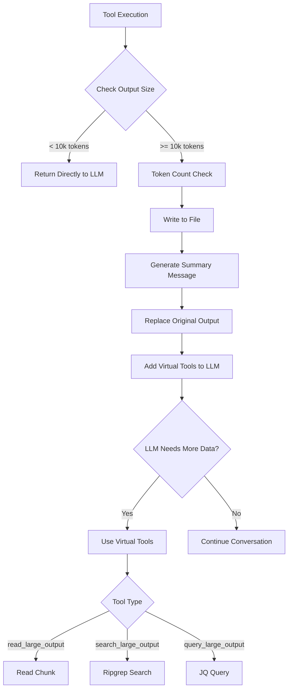

# Context Offloading

## 📋 Overview

The MCP Agent implements **Context Offloading**, a context engineering pattern where large tool outputs are automatically saved to the filesystem instead of being kept in the LLM's context window. This prevents context window overflow, reduces token costs, and enables efficient on-demand data access through specialized "Virtual Tools".

This pattern follows the "Offload Context" strategy described in [Manus's context engineering approach](https://rlancemartin.github.io/2025/10/15/manus/), where tool results are stored externally and accessed on-demand using utilities like `glob` and `grep`.

**Key Benefits:**
- Prevents context window overflow
- Reduces token costs by avoiding large payloads
- Maintains conversation performance
- Enables targeted data exploration

---

## 📁 Key Files & Locations

| Component | File | Key Functions |
|-----------|------|---------------|
| **Handler** | [`tool_output_handler.go`](../agent/tool_output_handler.go) | `NewToolOutputHandler()`, `IsLargeToolOutputWithModel()`, `WriteToolOutputToFile()`, `CreateToolOutputMessageWithPreview()` |
| **Virtual Tools** | [`large_output_virtual_tools.go`](../agent/large_output_virtual_tools.go) | `CreateLargeOutputVirtualTools()`, `HandleLargeOutputVirtualTool()`, `handleReadLargeOutput()`, `handleSearchLargeOutput()`, `handleQueryLargeOutput()` |
| **Agent Integration** | [`agent.go`](../agent/agent.go) | `WithLargeOutputVirtualTools()`, `WithLargeOutputThreshold()`, `WithToolOutputFolder()` |

---

## 🔄 How It Works

1. **Detection**: After every tool execution, the agent checks output size using token counting via `tiktoken`
2. **Interception**: If output exceeds threshold (default: 10,000 tokens):
   - Full content is saved to `tool_output_folder/{session_id}/tool_YYYYMMDD_HHMMSS_toolname.ext`
   - Original output is replaced with a summary message
3. **Notification**: Summary message includes:
   - File path where data is saved
   - Preview (first 50% of threshold characters)
   - Instructions for using virtual tools
4. **Inspection**: LLM uses virtual tools to read, search, or query the file as needed

---

## 🏗️ Architecture



---

## 🧰 Virtual Tools

### 1. `read_large_output`

Reads a specific range of characters from the file.

**Parameters:**
- `filename` (string): Name of the saved file
- `start` (int): Starting character position
- `end` (int): Ending character position

**Use Case:** Reading a file chunk by chunk (pagination).

**Example:**
```json
{
  "tool": "read_large_output",
  "args": {
    "filename": "tool_20250727_093045_tavily-search.json",
    "start": 0,
    "end": 5000
  }
}
```

### 2. `search_large_output`

Searches for regex patterns within the file using `ripgrep` (rg).

**Parameters:**
- `filename` (string): Name of the saved file
- `pattern` (string): Regex pattern to search for
- `case_sensitive` (bool): Whether search is case-sensitive
- `max_results` (int): Maximum number of results to return

**Use Case:** Finding specific error logs or keywords in a massive text file.

**Example:**
```json
{
  "tool": "search_large_output",
  "args": {
    "filename": "tool_20250727_093045_logs.txt",
    "pattern": "ERROR|FATAL",
    "case_sensitive": false,
    "max_results": 50
  }
}
```

### 3. `query_large_output`

Executes `jq` queries on JSON files.

**Parameters:**
- `filename` (string): Name of the saved JSON file
- `query` (string): jq query expression
- `compact` (bool, optional): Output compact JSON
- `raw` (bool, optional): Output raw strings (not JSON-encoded)

**Use Case:** Extracting specific fields from a large JSON response.

**Example:**
```json
{
  "tool": "query_large_output",
  "args": {
    "filename": "tool_20250727_093045_api-response.json",
    "query": ".results[] | select(.status == \"active\") | .name"
  }
}
```

---

## ⚙️ Configuration

### Agent Options

| Option | Type | Default | Description |
|--------|------|---------|-------------|
| `WithLargeOutputVirtualTools(enabled)` | `bool` | `true` | Enable/disable virtual tools for large outputs |
| `WithLargeOutputThreshold(tokens)` | `int` | `10000` | Token threshold for considering output as "large" (uses tiktoken encoding) |
| `WithToolOutputFolder(path)` | `string` | `"tool_output_folder"` | Directory path for storing large outputs |

### Example Configuration

```go
package main

import (
    "mcpagent/agent"
    "mcpagent/llm"
)

func main() {
    // Create agent with large output handling enabled
    agent, err := mcpagent.NewAgent(
        mcpClientManager,
        mcpagent.WithProvider(llm.NewOpenAIProvider()),
        
        // Enable large output handling (enabled by default)
        mcpagent.WithLargeOutputVirtualTools(true),
        
        // Set threshold in tokens (default: 10000)
        mcpagent.WithLargeOutputThreshold(10000),
        
        // Set custom output folder (default: "tool_output_folder")
        mcpagent.WithToolOutputFolder("./custom_outputs"),
    )
    if err != nil {
        panic(err)
    }
}
```

---

## 🛠️ Common Issues & Solutions

| Issue | Cause | Solution |
|-------|-------|----------|
| `file not found` error | LLM provided wrong filename | Check the summary message for the exact filename. Use the full path if needed: `tool_output_folder/session-id/filename.ext` |
| `path traversal detected` error | LLM tried to access files outside output folder | Only use filenames from the summary message. Path traversal (`../`) is blocked for security. See [`large_output_virtual_tools.go:16`](../agent/large_output_virtual_tools.go#L16) |
| `ripgrep not found` | `rg` command not installed on system | Install ripgrep: `brew install ripgrep` (Mac) or `apt-get install ripgrep` (Linux) |
| `jq not found` | `jq` command not installed on system | Install jq: `brew install jq` (Mac) or `apt-get install jq` (Linux) |
| Large output not intercepted | Threshold too high or handler disabled | Check `WithLargeOutputThreshold()` and `WithLargeOutputVirtualTools(true)` settings |

---

## 🔍 For LLMs: Quick Reference

### When to Use Virtual Tools

✅ **Use when:**
- You see a message: "Tool output was large and saved to file..."
- The message includes a filename like `tool_20250727_093045_toolname.ext`
- You need to inspect specific parts of the data

❌ **Don't use when:**
- The original tool output is already complete
- You have all the data needed to answer the user's question

### Tool Selection Guide

| Tool | Best For | Example Use Case |
|------|----------|------------------|
| `read_large_output` | Sequential reading, pagination | Reading logs line by line |
| `search_large_output` | Finding specific patterns | Searching for error messages in logs |
| `query_large_output` | Extracting JSON fields | Getting specific object properties from API responses |

### Filename Format

Files are named: `tool_YYYYMMDD_HHMMSS_toolname.ext`

**Important:** Use the EXACT filename from the summary message.

### Common Patterns

**Pattern 1: Iterative Reading**
```
1. Call read_large_output with start=0, end=10000
2. Analyze content
3. Call read_large_output with start=10000, end=20000
4. Continue until you have enough data
```

**Pattern 2: Targeted Search**
```
1. Call search_large_output with pattern="ERROR"
2. Review matches
3. If needed, call read_large_output at specific locations
```

**Pattern 3: JSON Extraction**
```
1. Call query_large_output with query to get specific fields
2. Use compact=true for minimal output
3. Use raw=true for raw string values (not JSON-encoded)
```

### Constraints

✅ **Allowed:**
- Reading any file in the output folder
- Multiple sequential reads
- Combining different virtual tools

❌ **Forbidden:**
- Path traversal (`../`) attempts
- Accessing files outside output folder
- Shell injection in patterns/queries

---

## 🔒 Security

### Path Validation

All file operations are restricted to the configured output folder. Path traversal (`../`) is blocked by `validateFilePath()` in [`large_output_virtual_tools.go`](../agent/large_output_virtual_tools.go).

**Implementation:**
```go
// validateFilePath ensures the file path is within the allowed directory
func validateFilePath(filePath, baseDir string) error {
    absFilePath, err := filepath.Abs(filePath)
    if err != nil {
        return fmt.Errorf("invalid file path: %w", err)
    }
    
    absBaseDir, err := filepath.Abs(baseDir)
    if err != nil {
        return fmt.Errorf("invalid base directory: %w", err)
    }
    
    if !strings.HasPrefix(absFilePath, absBaseDir) {
        return errors.New("path traversal detected")
    }
    
    return nil
}
```

### Command Injection Prevention

`ripgrep` and `jq` are executed using `exec.Command` with separate arguments, preventing shell injection attacks.

**Safe Execution:**
```go
// Safe: Arguments are passed separately, not through shell
cmd := exec.Command("rg", pattern, "--max-count", maxResults, filePath)

// Safe: Query is passed as argument, not evaluated by shell
cmd := exec.Command("jq", query, filePath)
```

---

## 📖 Related Documentation

- [doc_writing_guide.md](./doc_writing_guide.md) - Standards for writing technical documentation
- [smart_routing.md](./smart_routing.md) - Tool filtering and routing system
- [mcp_cache_system.md](./mcp_cache_system.md) - MCP server caching system
