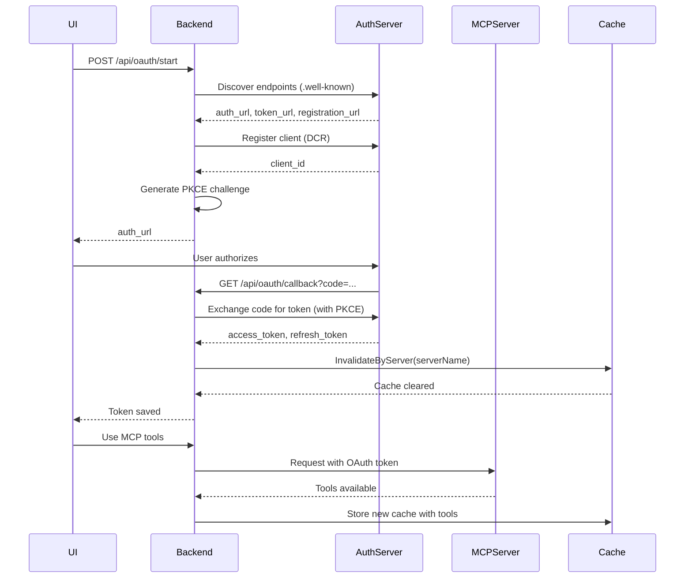

# OAuth Authentication System

## Overview

The OAuth system provides automated authentication for MCP servers that require OAuth 2.0/2.1. It supports multiple discovery mechanisms and secure authentication flows.

**Key Features:**
- **RFC 8414**: OAuth Authorization Server Metadata discovery via `.well-known/oauth-authorization-server`
- **RFC 9728**: Protected Resource Metadata discovery for modern servers (e.g., Smithery)
- **Dynamic Client Registration (DCR)**: Automatic client registration when supported
- **PKCE**: Secure authorization code flow without client secrets
- **Token Persistence**: OAuth config saved to user config after successful auth
- **Auto-Refresh**: Tokens automatically refreshed using refresh tokens
- **Cache Invalidation**: Automatic cache clearing after auth completion
- **Manual Refresh**: UI button to manually check/refresh token status

---

## Table of Contents

1. [Quick Start](#quick-start)
2. [Key Files & Locations](#key-files--locations)
3. [OAuth Flow](#oauth-flow)
4. [Configuration](#configuration)
5. [API Endpoints](#api-endpoints)
6. [Architecture](#architecture)
7. [Code Examples](#code-examples)
8. [CLI Usage](#cli-usage)
9. [Testing](#testing)
10. [Troubleshooting](#troubleshooting)

---

## Quick Start

### Minimal Config (Auto-Discovery)

```json
{
  "mcpServers": {
    "Notion": {
      "url": "https://mcp.notion.com/mcp",
      "oauth": {
        "auto_discover": true
      }
    }
  }
}
```

**Where fields come from:**
- `client_id` - Auto-generated by provider on first auth
- `auth_url` - Parsed from 401 response headers or `.well-known`
- `token_url` - Parsed from 401 response headers or `.well-known`
- `use_pkce` - Default `true` (always enabled for security)
- `token_file` - Default `~/.config/mcpagent/tokens/{server}.json`

### First-Time Setup

```bash
# 1. Run OAuth login (opens browser)
mcp oauth login Notion

# Output:
# Opening browser for authentication...
# Successfully authenticated with Notion
# Token expires: 2026-01-06 20:30:00

# 2. Normal usage - token automatically used & refreshed
mcp connect Notion
```

---

## Key Files & Locations

| Component | File | Key Functions |
|-----------|------|---------------|
| **OAuth Manager** | `oauth/manager.go` | `NewManager()`, `GenerateAuthURL()`, `ExchangeCodeForToken()`, `GetAccessToken()` |
| **Discovery** | `oauth/discovery.go` | `FetchAuthServerMetadata()`, `FetchProtectedResourceMetadata()`, `DiscoverFromAuthorizationServer()` |
| **Token Storage** | `oauth/token_store.go` | `Save()`, `Load()`, `IsValid()`, `ExpiresIn()` |
| **PKCE** | `oauth/pkce.go` | `GeneratePKCEPair()` |
| **Config** | `oauth/config.go` | `OAuthConfig`, `OAuthEndpoints` |
| **Callback Server** | `oauth/callback_server.go` | Handle browser redirects |

---

## OAuth Flow

### 1. Initial Discovery (No Auth)
- MCP server accessed for first time
- Server returns 401 with OAuth metadata OR auto-discovery attempted
- Cache stores entry with "OAuth required" error
- No tools available yet

### 2. Auto-Discovery (Multiple Methods)

The system tries multiple discovery mechanisms in order:

```go
// Method 1: RFC 9728 - Protected Resource Metadata (Smithery-style)
// Parses WWW-Authenticate header for resource_metadata parameter
// WWW-Authenticate: Bearer resource_metadata="https://server/.well-known/oauth-protected-resource"
resourceMetadata, err := FetchProtectedResourceMetadata(resourceMetadataURL)
// Contains: authorization_servers[] -> used to discover auth server metadata

// Method 2: RFC 8414 - OAuth Authorization Server Metadata
// Fetches from .well-known/oauth-authorization-server
metadata, err := FetchAuthServerMetadata(serverURL)
// Extracts: authorization_endpoint, token_endpoint, registration_endpoint

// Method 3: 401 Response Headers (fallback)
// Parses WWW-Authenticate realm and Link headers
endpoints, err := DiscoverFromResponse(resp)
// Extracts: auth_url from realm, token_url from Link header

// RFC 7591: Dynamic Client Registration (if supported)
regResponse, err := RegisterClient(metadata.RegistrationEndpoint, redirectURI)
// Receives: client_id, client_secret (optional for PKCE)
```

### 3. Authorization
```go
// Generate PKCE challenge
state, authURL, err := oauthMgr.GenerateAuthURL()
// User completes auth in browser
// Callback receives: code, state

// Exchange code for token
token, err := oauthMgr.ExchangeCodeForToken(ctx, code)
```

### 4. OAuth Config Persistence
```go
// After successful token exchange, persist OAuth config to user config file
// This ensures discovered endpoints are saved for token refresh
api.persistOAuthConfig(serverName, serverConfig)
// Saves to: mcp_servers_user.json (or equivalent _user.json file)
// Config includes: auth_url, token_url, client_id, token_file
```

### 5. Cache Invalidation
```go
// After successful token exchange
cacheManager.InvalidateByServer(configPath, serverName)
// Clears cache entries, removes generated code
// Next request will rediscover tools with OAuth
```

### 6. Token Usage & Auto-Refresh
```go
// GetAccessToken handles all token logic:
// 1. Load cached token from file
// 2. If valid, return immediately
// 3. If expired but has refresh_token, auto-refresh
// 4. Save refreshed token back to file
accessToken, err := oauthMgr.GetAccessToken(ctx)
// Token automatically added to Authorization header
```

---

## Configuration

### OAuth Config Fields

| Field | Required | Default | Purpose |
|-------|----------|---------|---------|
| `auto_discover` | No | `false` | Auto-discover OAuth endpoints via RFC 8414 |
| `use_pkce` | No | `true` | Use PKCE for enhanced security |
| `auth_url` | No* | - | Authorization endpoint (if not auto-discovering) |
| `token_url` | No* | - | Token endpoint (if not auto-discovering) |
| `client_id` | No | - | OAuth client ID (DCR can provide) |
| `client_secret` | No | - | OAuth client secret (not needed with PKCE) |
| `redirect_url` | No | `http://localhost:8000/api/oauth/callback` | OAuth callback URL |
| `token_file` | Yes | - | Where to store OAuth tokens |
| `scopes` | No | `[]` | OAuth scopes to request |

*Required if `auto_discover` is false

### Manual Configuration Example

```json
{
  "mcpServers": {
    "google-sheets": {
      "url": "https://sheets.googleapis.com/mcp",
      "oauth": {
        "client_id": "YOUR_CLIENT_ID.apps.googleusercontent.com",
        "client_secret": "GOCSPX-xxx",
        "auth_url": "https://accounts.google.com/o/oauth2/v2/auth",
        "token_url": "https://oauth2.googleapis.com/token",
        "scopes": ["https://www.googleapis.com/auth/spreadsheets"],
        "use_pkce": true,
        "token_file": "~/.config/mcpagent/tokens/google-sheets.json"
      }
    }
  }
}
```

---

## API Endpoints

| Endpoint | Method | Purpose |
|----------|--------|---------|
| `/api/oauth/start` | POST | Initiate OAuth flow, returns auth URL |
| `/api/oauth/callback` | GET | Receives OAuth callback, exchanges code for token |
| `/api/oauth/status` | GET | Check if token is valid and when it expires |
| `/api/oauth/logout` | POST | Remove OAuth token |

---

## Architecture



---

## Code Examples

### Backend (Server Routes)

```go
// Start OAuth flow
func (api *StreamingAPI) handleOAuthStart(w http.ResponseWriter, r *http.Request) {
    var req OAuthLoginRequest
    json.NewDecoder(r.Body).Decode(&req)

    serverConfig, _ := config.GetServer(req.ServerName)
    oauthMgr := oauth.NewManager(serverConfig.OAuth, logger)

    // Generate auth URL with PKCE
    state, authURL, err := oauthMgr.GenerateAuthURL()

    // Return URL to frontend
    json.NewEncoder(w).Encode(OAuthStartResponse{
        AuthURL: authURL,
        State:   state,
    })
}

// Handle callback
func (api *StreamingAPI) handleOAuthCallback(w http.ResponseWriter, r *http.Request) {
    code := r.URL.Query().Get("code")
    state := r.URL.Query().Get("state")

    flow := oauthFlows[state]

    // Exchange code for token
    token, err := flow.Manager.ExchangeCodeForToken(ctx, code)

    // Invalidate cache to refresh tools
    api.cacheManager.InvalidateByServer(api.mcpConfigPath, flow.ServerName)
}
```

### Frontend (React)

```typescript
import { oauthApi } from '../services/oauthApi';

// Start OAuth flow
const handleLogin = async () => {
  const response = await oauthApi.startOAuthFlow('Notion');
  window.open(response.auth_url, '_blank');

  // Poll for completion
  const interval = setInterval(async () => {
    const status = await oauthApi.getOAuthStatus('Notion');
    if (status.valid) {
      clearInterval(interval);
      // OAuth complete - tools now available
    }
  }, 2000);
};
```

### MCP Client Integration

```go
// Client handles OAuth automatically
client := mcpclient.New(serverConfig, logger)
err := client.Connect(ctx)
// If token missing, returns error with instruction to run: mcp oauth login
```

---

## CLI Usage

### Check Status

```bash
mcp oauth status Notion

# Output:
# Token valid until: 2026-01-06 20:30:00
# Token file: ~/.config/mcpagent/tokens/notion.json
```

### Logout

```bash
mcp oauth logout Notion

# Output:
# Token removed for Notion
```

---

## Testing

### Running E2E Test

```bash
# Build test binary
cd /Users/mipl/ai-work/mcpagent
go build -o mcpagent-test ./cmd/testing

# Run OAuth test
./mcpagent-test test oauth-flow --log-file logs/oauth-test.log

# With debug output
./mcpagent-test test oauth-flow --log-level debug
```

### Test Steps

1. **Create Config** - Temporary Notion MCP config with OAuth auto-discovery
2. **OAuth Login** - Interactive browser-based authentication
3. **Verify Token** - Check token file created with correct permissions
4. **Test Connection** - Use cached token to connect to Notion MCP
5. **Test Logout** - Remove token and verify cleanup

### Prerequisites

- Notion account with workspace access
- Browser installed and can open automatically
- Network connection to mcp.notion.com
- Port 8080 available for OAuth callback

### Success Criteria

A successful test should:
1. Create temporary OAuth config
2. Open browser to Notion auth page automatically
3. Wait for user to complete authentication
4. Receive OAuth callback with authorization code
5. Exchange code for access token and refresh token
6. Save token to file with 0600 permissions
7. Successfully connect using cached token
8. Clean up token file on logout
9. Complete without panics or unexpected errors

---

## Troubleshooting

| Issue | Cause | Solution |
|-------|-------|----------|
| "Failed to discover OAuth endpoints" | Server doesn't support RFC 8414 | Manually configure `auth_url` and `token_url` |
| "Registration failed" | Server doesn't support DCR | Manually configure `client_id` |
| "Invalid redirect_uri" | Redirect URL not registered | Check server allows `http://localhost:8000/api/oauth/callback` |
| "Tools still not available" | Cache not invalidated | Cache auto-invalidates after OAuth - wait for next request |
| "Token expired" | Token TTL passed | Manager auto-refreshes if `refresh_token` available |
| "bind: address already in use (port 8080)" | Another process using port | Kill process: `lsof -ti:8080 \| xargs kill` |
| "Browser didn't open automatically" | System browser not configured | Manually copy URL from logs and open in browser |

---

## Token Storage

### Location

```
~/.config/mcpagent/tokens/{ServerName}.json
```

### Format

```json
{
  "access_token": "ya29.a0AfH6...",
  "refresh_token": "1//0gw...",
  "token_type": "Bearer",
  "expiry": "2026-01-06T15:30:00Z"
}
```

### Security

- Token files are stored with `0600` permissions (user read/write only)
- Never commit token files to version control

---

## For LLMs: Quick Reference

**OAuth Flow States:**
```go
type OAuthFlowState struct {
    ServerName   string
    State        string                    // CSRF protection
    CodeChan     chan string               // Receives auth code from callback
    ErrChan      chan error                // Receives errors
    Manager      *oauth.Manager            // Handles token exchange
    ServerConfig mcpclient.MCPServerConfig // Persisted after OAuth success
}
```

**Discovery Types (RFC 9728 + RFC 8414):**
```go
// RFC 9728: Protected Resource Metadata
type ProtectedResourceMetadata struct {
    Resource             string   `json:"resource"`
    AuthorizationServers []string `json:"authorization_servers"`
}

// RFC 8414: Authorization Server Metadata
type AuthServerMetadata struct {
    Issuer                string `json:"issuer"`
    AuthorizationEndpoint string `json:"authorization_endpoint"`
    TokenEndpoint         string `json:"token_endpoint"`
    RegistrationEndpoint  string `json:"registration_endpoint,omitempty"`
}
```

**Token Structure:**
```go
type Token struct {
    AccessToken  string    `json:"access_token"`
    RefreshToken string    `json:"refresh_token,omitempty"`
    TokenType    string    `json:"token_type"`
    Expiry       time.Time `json:"expiry"`
}
```

**Zero Expiry Handling:**
```go
// Tokens with zero expiry time are treated as "never expires"
if token.Expiry.IsZero() {
    return 100 * 365 * 24 * time.Hour // Symbolic "forever"
}
```

**Key Constraints:**
- PKCE is recommended (no client secret needed)
- State parameter validates callbacks (CSRF protection)
- Tokens auto-refresh if refresh_token available
- Cache auto-invalidates after OAuth success
- Don't store client secrets in config (use PKCE instead)
- Don't skip state validation
