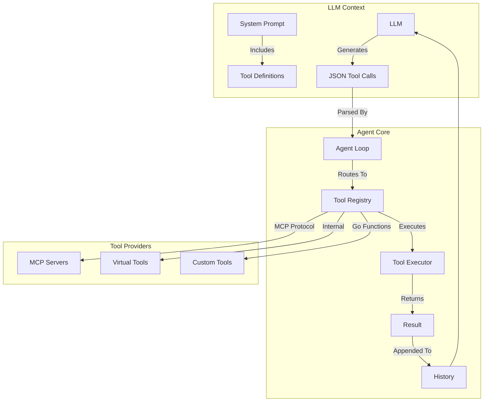

# Standard Tool-Use Agent Architecture

The **Standard Tool-Use Agent** (also known as `SimpleAgent`) is the default operating mode where the LLM interacts with the system by invoking tools directly through the LLM provider's native tool calling capability (e.g., OpenAI Function Calling).

Unlike the Code Execution Agent which writes Go programs to execute tasks, the Standard Agent relies on a request-response loop where the LLM requests a tool execution, the system executes it, and returns the result as a new message.

---

## 🏗️ System Architecture

The system acts as an orchestrator between the LLM and the Model Context Protocol (MCP) servers.



---

## 🧩 Core Components

### 1. Agent Configuration
The standard mode is the default, but can be explicitly set using `WithMode(SimpleAgent)`.

```go
// pkg/mcpagent/agent.go
agent, err := mcpagent.NewAgent(..., 
    mcpagent.WithMode(mcpagent.SimpleAgent), // Default
)
```

**Effect:**
- Registers all available MCP tools directly with the LLM as function definitions.
- Registers Virtual Tools and Custom Tools.
- The LLM sees a list of available functions it can call.

### 2. Tool Execution Loop
The execution logic resides in `pkg/mcpagent/conversation.go`.

1.  **LLM Generation**: The agent sends the conversation history and tool definitions to the LLM.
2.  **Tool Selection**: The LLM decides to call a tool and generates a JSON payload.
3.  **Routing**: The agent determines the type of tool (MCP, Virtual, or Custom).
4.  **Execution**:
    *   **MCP Tools**: Forwarded to the appropriate MCP server via `client.CallTool`.
    *   **Virtual Tools**: Executed locally by the agent (e.g., `get_prompt`, `read_large_output`).
    *   **Custom Tools**: Executed as native Go functions.
5.  **Result Handling**: The output is captured and appended to the conversation history.
6.  **Iteration**: The loop continues until the LLM provides a final text response or `MaxTurns` is reached.

### 3. Smart Routing
When too many tools are available (exceeding context limits), the agent can use **Smart Routing**.

```go
mcpagent.WithSmartRouting(true)
```

**How it works:**
- Analyzes the conversation context.
- Filters the list of tools to only include those relevant to the current task.
- Reduces token usage and improves LLM focus.

---

## 🛠️ Tool Types

The Standard Agent supports three categories of tools:

### 1. MCP Tools
Remote tools provided by connected MCP servers.
- **Discovery**: Automatically discovered via `client.ListTools`.
- **Execution**: Delegated to the MCP server.
- **Example**: `filesystem.read_file`, `git.commit`.

### 2. Virtual Tools
Internal tools provided by the agent framework for system operations.
- **Purpose**: Handling large outputs, prompt management, resource discovery.
- **Examples**:
    - `read_large_output`: Reads a file created by a tool that produced too much output.
    - `get_prompt`: Retrieves a prompt from the MCP server.

### 3. Custom Tools
Native Go functions registered programmatically.
- **Purpose**: Application-specific logic that doesn't need a full MCP server.
- **Registration**:
```go
agent.RegisterCustomTool("my_tool", "Description", params, func(ctx context.Context, args map[string]interface{}) (string, error) {
    // Go logic here
    return "result", nil
}, "category")
```

---

## 🆚 Comparison with Code Execution Agent

| Feature | Standard Tool-Use Agent | Code Execution Agent |
|---------|------------------------|----------------------|
| **Interaction** | JSON Tool Calls (Function Calling) | Generated Go Code |
| **Logic** | Linear, step-by-step | Loops, conditionals, complex logic |
| **Type Safety** | Runtime validation (JSON Schema) | Compile-time validation (Go Compiler) |
| **Performance** | Multiple round-trips for complex tasks | Single execution for batched tasks |
| **Safety** | Restricted by tool definitions | Sandboxed execution environment |
| **Use Case** | General purpose, simple tasks | Complex data processing, multi-step workflows |

---

## 🔒 Error Handling & Recovery

The Standard Agent includes robust error handling mechanisms:

1.  **Self-Correction**: If a tool call fails (e.g., invalid arguments), the error is fed back to the LLM so it can correct its mistake in the next turn.
2.  **Broken Pipe Recovery**: Automatically attempts to reconnect to MCP servers if a connection drops.
3.  **Large Output Handling**: Automatically intercepts tool outputs that exceed token limits, writes them to a file, and provides the LLM with a tool to read the file.
